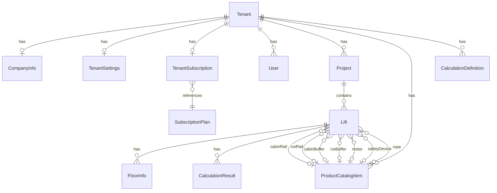
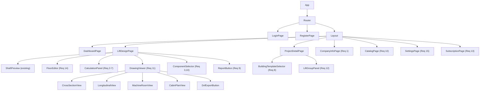

# Design Document: ASCAD Web SaaS Platform

## Overview

This design extends the existing ASCAD Web application — an ASP.NET Core 8.0 + React 18 elevator design platform — into a full-featured multi-tenant SaaS product. The existing implementation provides JWT authentication, project/lift CRUD, a basic hardcoded calculation engine, and a canvas-based shaft preview. This design adds: a dynamic database-driven calculation engine with NCalc formula evaluation, product catalog management, building type templates, PDF report generation, 2D CAD drawing generation (SVG + DXF), enhanced floor management with auto-calculations, multi-elevator group support, subscription/billing, tenant settings, and a formula parser with round-trip capability.

The architecture preserves the existing Clean Architecture layers (Api → Core → Infrastructure) and extends each with new entities, services, and controllers. The React frontend gains new pages and components for catalog management, building templates, drawing views, settings, and subscription management.

## Architecture

### High-Level Component Diagram

```mermaid
graph TB
    subgraph "Frontend - React 18 + TypeScript + Vite"
        FE_Auth[Auth Pages]
        FE_Dash[Dashboard]
        FE_Proj[Project Detail]
        FE_Lift[Lift Design]
        FE_Draw[Drawing Viewer]
        FE_Cat[Product Catalog]
        FE_Tmpl[Building Templates]
        FE_Set[Tenant Settings]
        FE_Sub[Subscription]
        FE_Co[Company Info]
        FE_Floor[Floor Editor]
    end

    subgraph "API Layer - ASP.NET Core 8.0"
        C_Auth[AuthController]
        C_Proj[ProjectsController]
        C_Lift[LiftsController]
        C_Calc[CalculationsController]
        C_Cat[ProductCatalogController]
        C_Tmpl[BuildingTemplatesController]
        C_Draw[DrawingsController]
        C_PDF[ReportsController]
        C_Co[CompanyInfoController]
        C_Set[SettingsController]
        C_Sub[SubscriptionsController]
        C_Floor[FloorsController]
        MW_Tenant[TenantMiddleware]
        MW_Sub[SubscriptionMiddleware]
    end

    subgraph "Core Layer - Business Logic"
        S_Calc[DynamicCalculationService]
        S_Formula[FormulaParserService]
        S_Cat[ProductCatalogService]
        S_Tmpl[BuildingTemplateService]
        S_Draw[DrawingGeneratorService]
        S_PDF[PdfReportGeneratorService]
        S_Floor[FloorCalculationService]
        S_Sub[SubscriptionService]
        S_Set[SettingsService]
        S_Co[CompanyInfoService]
        S_Group[LiftGroupService]
    end

    subgraph "Infrastructure Layer"
        DB[(PostgreSQL)]
        Repo[Repositories]
        EF[EF Core DbContext]
    end

    FE_Auth --> C_Auth
    FE_Dash --> C_Proj
    FE_Proj --> C_Lift
    FE_Lift --> C_Calc
    FE_Draw --> C_Draw
    FE_Cat --> C_Cat
    FE_Tmpl --> C_Tmpl
    FE_Set --> C_Set
    FE_Sub --> C_Sub
    FE_Co --> C_Co
    FE_Floor --> C_Floor

    C_Calc --> S_Calc
    C_Calc --> S_Formula
    C_Cat --> S_Cat
    C_Tmpl --> S_Tmpl
    C_Draw --> S_Draw
    C_PDF --> S_PDF
    C_Floor --> S_Floor
    C_Sub --> S_Sub
    C_Set --> S_Set
    C_Co --> S_Co
    C_Lift --> S_Group

    S_Calc --> Repo
    S_Cat --> Repo
    S_Tmpl --> Repo
    S_Floor --> Repo
    S_Sub --> Repo
    S_Set --> Repo
    S_Co --> Repo
    S_Group --> Repo
    Repo --> EF --> DB
```



### Layer Responsibilities

- **Api Layer**: HTTP controllers, request validation, middleware (tenant resolution, subscription enforcement), Swagger docs. New controllers for each feature domain.
- **Core Layer**: Domain entities, DTOs, service interfaces, business logic implementations. No infrastructure dependencies.
- **Infrastructure Layer**: EF Core DbContext, repository implementations, database migrations. Extended with new DbSets and configurations.

### Key Design Decisions

1. **Dynamic Calculation Engine**: Replaces the hardcoded `CalculationService` with a database-driven engine that reads calculation definitions (formulas, conditions, lookups) from a `CalculationDefinition` table and evaluates them using NCalc2 (already referenced in the project). This mirrors the original desktop `hesaplamalar.cs` approach.

2. **Formula Parser**: A standalone recursive-descent parser that converts formula strings to an AST and back. Used for validation, display, and round-trip testing. Separate from NCalc evaluation.

3. **SVG-first Drawing Generation**: Drawings are generated server-side as SVG strings. DXF export converts SVG geometry to DXF format. No external CAD libraries required.

4. **PDF via QuestPDF**: Uses QuestPDF (MIT license, .NET native) for PDF generation — no external service dependencies.

5. **Tenant Isolation**: All queries are filtered by TenantId. A `TenantMiddleware` extracts TenantId from JWT claims and makes it available via `ITenantContext`.

## Components and Interfaces

### New Service Interfaces

```csharp
// Core/Interfaces/IDynamicCalculationService.cs
public interface IDynamicCalculationService
{
    Task<List<CalculationResult>> ExecuteCalculationsAsync(Lift lift, Guid tenantId);
}

// Core/Interfaces/IFormulaParser.cs
public interface IFormulaParser
{
    FormulaExpression Parse(string formula);
    string PrettyPrint(FormulaExpression expression);
}

// Core/Interfaces/IProductCatalogService.cs
public interface IProductCatalogService
{
    Task<ProductCatalogItem?> GetByIdAsync(Guid id, Guid tenantId);
    Task<List<ProductCatalogItem>> GetByCategoryAsync(string category, Guid tenantId);
    Task<List<ProductCatalogItem>> SearchAsync(string? category, string? modelName, Guid tenantId);
    Task<ProductCatalogItem> CreateAsync(CreateCatalogItemRequest request, Guid tenantId);
    Task<ProductCatalogItem> UpdateAsync(Guid id, UpdateCatalogItemRequest request, Guid tenantId);
    Task DeleteAsync(Guid id, Guid tenantId);
    Task SeedDefaultsAsync(Guid tenantId);
}

// Core/Interfaces/IBuildingTemplateService.cs
public interface IBuildingTemplateService
{
    List<string> GetAvailableBuildingTypes();
    BuildingTemplateResult ApplyTemplate(BuildingTemplateRequest request);
}

// Core/Interfaces/IDrawingGeneratorService.cs
public interface IDrawingGeneratorService
{
    string GenerateShaftCrossSection(Lift lift);
    string GenerateLongitudinalSection(Lift lift);
    string GenerateMachineRoomLayout(Lift lift);
    string GenerateCabinPlan(Lift lift);
    string GenerateGroupCrossSection(List<Lift> lifts, int partitionWallThickness);
    byte[] ExportToDxf(string svgContent, string drawingType);
}

// Core/Interfaces/IPdfReportGeneratorService.cs
public interface IPdfReportGeneratorService
{
    Task<byte[]> GenerateCalculationReportAsync(Lift lift, CompanyInfo? companyInfo, Project project);
}

// Core/Interfaces/IFloorCalculationService.cs
public interface IFloorCalculationService
{
    List<FloorInfo> CalculateArchitecturalLevels(List<FloorInfo> floors);
    int CalculateTravelDistance(List<FloorInfo> floors);
    int CalculatePitDepth(List<FloorInfo> floors, int beyanYuk);
    int CalculateOverheadClearance(List<FloorInfo> floors, int machineRoomHeight);
}

// Core/Interfaces/ISubscriptionService.cs
public interface ISubscriptionService
{
    Task<SubscriptionPlan> GetPlanAsync(Guid tenantId);
    Task<UsageStats> GetUsageAsync(Guid tenantId);
    Task EnforceProjectLimitAsync(Guid tenantId);
    Task EnforceUserLimitAsync(Guid tenantId);
    Task EnforceExportLimitAsync(Guid tenantId);
    Task IncrementExportCountAsync(Guid tenantId);
}

// Core/Interfaces/ISettingsService.cs
public interface ISettingsService
{
    Task<TenantSettings> GetSettingsAsync(Guid tenantId);
    Task<TenantSettings> UpdateSettingsAsync(Guid tenantId, UpdateSettingsRequest request);
}

// Core/Interfaces/ICompanyInfoService.cs
public interface ICompanyInfoService
{
    Task<CompanyInfo> GetOrCreateAsync(Guid tenantId);
    Task<CompanyInfo> UpdateAsync(Guid tenantId, UpdateCompanyInfoRequest request);
}

// Core/Interfaces/ILiftGroupService.cs
public interface ILiftGroupService
{
    Task<int> CalculateGroupShaftWidth(Guid projectId, string groupId, int partitionWallThickness);
    Task<List<Lift>> GetGroupLiftsAsync(Guid projectId, string groupId);
}

// Core/Interfaces/ITenantContext.cs
public interface ITenantContext
{
    Guid TenantId { get; }
}
```

### New API Endpoints

| Method | Route | Controller | Description | Req |
|--------|-------|-----------|-------------|-----|
| GET | `/api/company-info` | CompanyInfoController | Get tenant company info | 1 |
| PUT | `/api/company-info` | CompanyInfoController | Update company info | 1 |
| POST | `/api/lifts/{id}/calculate` | CalculationsController | Run dynamic calculations | 2-7 |
| GET | `/api/catalog` | ProductCatalogController | List/search catalog items | 3,10 |
| GET | `/api/catalog/{id}` | ProductCatalogController | Get catalog item | 3,10 |
| POST | `/api/catalog` | ProductCatalogController | Create catalog item | 10 |
| PUT | `/api/catalog/{id}` | ProductCatalogController | Update catalog item | 10 |
| DELETE | `/api/catalog/{id}` | ProductCatalogController | Delete catalog item | 10 |
| GET | `/api/catalog/rails` | ProductCatalogController | List rail models | 3 |
| GET | `/api/building-templates` | BuildingTemplatesController | List building types | 8 |
| POST | `/api/building-templates/apply` | BuildingTemplatesController | Apply template | 8 |
| GET | `/api/lifts/{id}/drawings/{type}` | DrawingsController | Get SVG drawing | 11 |
| GET | `/api/lifts/{id}/drawings/{type}/dxf` | DrawingsController | Export DXF | 11 |
| GET | `/api/lifts/{id}/drawings/group` | DrawingsController | Group cross-section | 12 |
| POST | `/api/lifts/{id}/report` | ReportsController | Generate PDF report | 9 |
| PUT | `/api/lifts/{id}/floors` | FloorsController | Update floors (auto-calc) | 14 |
| GET | `/api/subscription` | SubscriptionsController | Get plan & usage | 13 |
| PUT | `/api/subscription/plan` | SubscriptionsController | Change plan | 13 |
| GET | `/api/settings` | SettingsController | Get tenant settings | 15 |
| PUT | `/api/settings` | SettingsController | Update tenant settings | 15 |


## Data Models

### New Entities

```csharp
// CalculationDefinition — database-driven calculation rows (replaces hardcoded logic)
public class CalculationDefinition : BaseEntity
{
    public Guid TenantId { get; set; }
    public int Sira { get; set; }                    // Execution order
    public string Parametre { get; set; }             // Parameter name (e.g., "KabinGen")
    public string Standart { get; set; }              // GENEL | GENELFRM | SORG | {table}-{fk}
    public string Aciklama { get; set; }              // Description
    public string Formul { get; set; }                // NCalc formula string
    public string Birim { get; set; }                 // Unit (mm, kg, etc.)
    public string VeriTipi { get; set; } = "d";       // d=decimal, s=string
    public string? TipKodu { get; set; }              // EA, HA, or TEMEL (all)
    public string? TahrikKodu { get; set; }           // DA, MDDUZ, etc. or TEMEL
    public string? YonKodu { get; set; }              // SOL, SAG, ARKA, or TEMEL
    public bool IsActive { get; set; } = true;

    public Tenant Tenant { get; set; } = null!;
}

// ProductCatalogItem — master data for elevator components
public class ProductCatalogItem : BaseEntity
{
    public Guid TenantId { get; set; }
    public string Category { get; set; }              // ray, tampon, motor, kapi, fren, halat
    public string ModelName { get; set; }             // e.g., "70x65x9"
    public string? Description { get; set; }

    // Technical specs stored as JSON for flexibility across categories
    public string SpecsJson { get; set; } = "{}";

    public Tenant Tenant { get; set; } = null!;
}

// RailSpec — strongly-typed rail properties (deserialized from SpecsJson for rail category)
public class RailSpec
{
    public double WeightPerMeter { get; set; }        // kg/m
    public double Ix { get; set; }                    // Moment of inertia X (cm⁴)
    public double Iy { get; set; }                    // Moment of inertia Y (cm⁴)
    public double Wx { get; set; }                    // Section modulus X (cm³)
    public double Wy { get; set; }                    // Section modulus Y (cm³)
    public double CrossSectionalArea { get; set; }    // cm²
}

// SubscriptionPlan — plan definitions
public class SubscriptionPlan : BaseEntity
{
    public string Name { get; set; }                  // Basic, Professional, Enterprise
    public int MaxProjects { get; set; }
    public int MaxUsersPerTenant { get; set; }
    public int MaxPdfExportsPerMonth { get; set; }
    public decimal MonthlyPrice { get; set; }
    public bool IsActive { get; set; } = true;
}

// TenantSubscription — tenant's active subscription
public class TenantSubscription : BaseEntity
{
    public Guid TenantId { get; set; }
    public Guid PlanId { get; set; }
    public DateTime StartDate { get; set; }
    public DateTime? EndDate { get; set; }
    public int MonthlyPdfExportCount { get; set; }
    public DateTime ExportCountResetDate { get; set; }
    public string? StripeCustomerId { get; set; }     // Placeholder for Stripe
    public string? StripeSubscriptionId { get; set; } // Placeholder for Stripe

    public Tenant Tenant { get; set; } = null!;
    public SubscriptionPlan Plan { get; set; } = null!;
}

// TenantSettings — per-tenant configuration
public class TenantSettings : BaseEntity
{
    public Guid TenantId { get; set; }

    // Default lift parameters
    public int DefaultKuyuGenisligi { get; set; } = 2000;
    public int DefaultKuyuDerinligi { get; set; } = 2500;
    public int DefaultKapiGenisligi { get; set; } = 900;
    public int DefaultKatYuksekligi { get; set; } = 3000;
    public string DefaultTahrikKodu { get; set; } = "DA";
    public string DefaultKabinRayStr { get; set; } = "70x65x9";
    public string DefaultAgrRayStr { get; set; } = "50x50x5";

    // Language
    public string Language { get; set; } = "tr";

    // Drawing preferences
    public double DefaultScaleFactor { get; set; } = 1.0;
    public int DimensionTextSize { get; set; } = 12;
    public double LineWeight { get; set; } = 1.0;

    public Tenant Tenant { get; set; } = null!;
}

// BuildingTemplate — not persisted, computed in-memory
public class BuildingTemplateResult
{
    public string BuildingType { get; set; }
    public int OccupantCount { get; set; }
    public int RecommendedMinCabinWidth { get; set; }
    public int RecommendedMinCabinDepth { get; set; }
    public int RecommendedMinLoadCapacity { get; set; }
    public int RecommendedElevatorCount { get; set; }
    public bool RequiresAdditionalCapacityReview { get; set; }
}
```

### Extended Existing Entities

```csharp
// Lift — add group support (Req 12)
public class Lift : BaseEntity
{
    // ... existing fields ...

    // NEW: Group support for multi-elevator shafts
    public string? GroupId { get; set; }              // Shared-shaft group identifier
    public int? GroupPosition { get; set; }           // Position within group (1, 2, 3...)

    // NEW: Speed for buffer/safety calculations (Req 5-7)
    public double RatedSpeed { get; set; } = 1.0;    // m/s
    public double BalanceRatio { get; set; } = 0.5;   // Counterweight balance ratio

    // NEW: Component references from catalog
    public Guid? CabinRailCatalogId { get; set; }
    public Guid? CounterweightRailCatalogId { get; set; }
    public Guid? CabinBufferCatalogId { get; set; }
    public Guid? CounterweightBufferCatalogId { get; set; }
    public Guid? MotorCatalogId { get; set; }
    public Guid? SafetyDeviceCatalogId { get; set; }
    public Guid? RopeCatalogId { get; set; }
}
```

### Formula Parser AST (Req 17)

```csharp
// Core/Models/FormulaExpression.cs
public abstract record FormulaExpression;
public record NumberLiteral(double Value) : FormulaExpression;
public record ParameterRef(string Name) : FormulaExpression;
public record BinaryOp(FormulaExpression Left, string Operator, FormulaExpression Right) : FormulaExpression;
public record ComparisonOp(FormulaExpression Left, string Operator, FormulaExpression Right) : FormulaExpression;
public record ConditionalExpr(FormulaExpression Condition, FormulaExpression ThenExpr, FormulaExpression ElseExpr) : FormulaExpression;
```

### Database Schema Changes



### New DTOs

```csharp
// Company Info
public record UpdateCompanyInfoRequest(
    string? Ad, string? Adres, string? Telefon, string? Fax, string? Email,
    string? Yetkili, string? Marka, string? VergiDairesi, string? VergiNo,
    string? OnayliKurulusAd, string? OnayliKurulusNo,
    DateTime? SanayiTarih, string? SanayiNo, DateTime? HYBTarih, string? HYBNo,
    string? MakinaMuhAd, string? MakinaMuhOdaSicil, string? MakinaMuhBelge, string? MakinaMuhSMM,
    string? ElektrikMuhAd, string? ElektrikMuhOdaSicil, string? ElektrikMuhBelge, string? ElektrikMuhSMM
);

// Product Catalog
public record CreateCatalogItemRequest(string Category, string ModelName, string? Description, string SpecsJson);
public record UpdateCatalogItemRequest(string? ModelName, string? Description, string? SpecsJson);
public record CatalogItemResponse(Guid Id, string Category, string ModelName, string? Description, string SpecsJson);

// Building Template
public record BuildingTemplateRequest(string BuildingType, Dictionary<string, int> Parameters);
// Parameters: Konut → {"1+1": 10, "2+1": 20, ...}, Otel → {"bedCount": 200}, Hastane → {"bedCount": 100}

// Subscription
public record UsageStats(string PlanName, int ProjectCount, int ProjectLimit,
    int UserCount, int UserLimit, int PdfExportCount, int PdfExportLimit);

// Settings
public record UpdateSettingsRequest(
    int? DefaultKuyuGenisligi, int? DefaultKuyuDerinligi, int? DefaultKapiGenisligi,
    int? DefaultKatYuksekligi, string? DefaultTahrikKodu,
    string? DefaultKabinRayStr, string? DefaultAgrRayStr,
    string? Language, double? DefaultScaleFactor, int? DimensionTextSize, double? LineWeight
);

// Floor update with auto-calculation response
public record UpdateFloorsRequest(List<FloorInfoDto> Floors);
public record FloorCalculationResponse(
    List<FloorInfoDto> Floors, int TravelDistance, int PitDepth, int OverheadClearance
);
```


### Frontend Component Hierarchy



### New Frontend Pages and Components

| Component | Route | Description |
|-----------|-------|-------------|
| `CompanyInfoPage` | `/settings/company` | Company profile form with engineer certifications |
| `CatalogPage` | `/catalog` | Product catalog CRUD with category tabs |
| `SettingsPage` | `/settings` | Tenant defaults, language, drawing preferences |
| `SubscriptionPage` | `/subscription` | Plan info, usage stats, upgrade options |
| `FloorEditor` | (embedded in LiftDesignPage) | Floor table with auto-calculated mimari kot |
| `DrawingViewer` | (embedded in LiftDesignPage) | SVG rendering with tab switching + DXF export |
| `BuildingTemplateSelector` | (embedded in ProjectDetailPage) | Building type dropdown with parameter inputs |
| `ComponentSelector` | (embedded in LiftDesignPage) | Catalog-backed dropdowns for rails, buffers, etc. |
| `LiftGroupPanel` | (embedded in ProjectDetailPage) | Group assignment and combined shaft view |
| `CalculationPanel` | (embedded in LiftDesignPage) | Enhanced calculation results with dynamic engine |

## Error Handling

### API Error Response Format

All API errors return a consistent JSON structure:

```json
{
  "error": {
    "code": "VALIDATION_ERROR",
    "message": "Field 'Ad' exceeds maximum length of 255 characters.",
    "field": "Ad"
  }
}
```

### Error Categories

| Code | HTTP Status | Description |
|------|-------------|-------------|
| `VALIDATION_ERROR` | 400 | Input validation failure (field length, required fields, invalid format) |
| `PLAN_LIMIT_EXCEEDED` | 403 | Subscription plan limit reached (projects, users, exports) |
| `COMPONENT_IN_USE` | 409 | Cannot delete catalog item referenced by a Lift |
| `FORMULA_PARSE_ERROR` | 400 | Invalid formula syntax in calculation definition |
| `PARAMETER_UNDEFINED` | 422 | Formula references an undefined parameter during calculation |
| `TEMPLATE_INVALID` | 400 | Invalid building template parameters |
| `NOT_FOUND` | 404 | Resource not found or not accessible by tenant |
| `UNAUTHORIZED` | 401 | Missing or invalid JWT token |

### Calculation Engine Error Handling

- When a formula references an undefined parameter, the engine records an error result for that row (FormulSonuc = "ERR", Aciklama includes the missing parameter name) and continues processing remaining calculations. This matches the original desktop behavior where individual calculation failures don't halt the entire run.
- When a master data lookup fails (e.g., rail model not found in catalog), the engine records an error result and continues.
- NCalc evaluation exceptions are caught per-row and recorded as error results.

### Subscription Enforcement

- `SubscriptionMiddleware` runs before controllers and checks plan limits for write operations.
- Project creation checks project count against plan limit.
- User invitation checks user count against plan limit.
- PDF export checks monthly export count against plan limit.
- All limit violations return `PLAN_LIMIT_EXCEEDED` with a message indicating the specific limit and current usage.

### Company Info Validation

- All string fields are validated against a 255-character maximum.
- If any field exceeds the limit, the request is rejected with a `VALIDATION_ERROR` specifying the offending field name.


## Correctness Properties

*A property is a characteristic or behavior that should hold true across all valid executions of a system — essentially, a formal statement about what the system should do. Properties serve as the bridge between human-readable specifications and machine-verifiable correctness guarantees.*

### Property 1: CompanyInfo storage round-trip

*For any* valid CompanyInfo object with all fields populated (company name, address, phone, fax, email, brand, tax info, mechanical engineer info, electrical engineer info, approved organization info), storing it via the CompanyInfoService and then retrieving it for the same tenant SHALL produce an object with identical field values.

**Validates: Requirements 1.1, 1.2, 1.3, 1.4, 1.5**

### Property 2: CompanyInfo field length validation

*For any* CompanyInfo field and *for any* string value with length exceeding 255 characters, submitting an update request containing that value SHALL be rejected with a validation error that specifies the offending field name.

**Validates: Requirements 1.7**

### Property 3: GENELFRM formula evaluation correctness

*For any* valid GENELFRM calculation definition with a formula string and *for any* parameter dictionary containing all referenced parameters with numeric values, the DynamicCalculationService SHALL evaluate the formula by substituting parameters and computing the mathematical result, producing a FormulDeger containing the substituted expression and a FormulSonuc matching the expected numeric evaluation.

**Validates: Requirements 2.2, 2.7, 4.1, 4.2, 4.3, 5.1, 6.1, 7.1**

### Property 4: SORG compliance check correctness

*For any* valid SORG calculation definition with a conditional expression and *for any* parameter dictionary containing all referenced parameters, the DynamicCalculationService SHALL return "UY" when the condition evaluates to true and "UD" when the condition evaluates to false.

**Validates: Requirements 2.3, 5.2, 5.3, 6.2, 6.3, 7.2, 7.3, 7.4**

### Property 5: Calculation parameter accumulation

*For any* ordered sequence of calculation definitions where definition at position N references the parameter name of definition at position M (where M < N), the DynamicCalculationService SHALL make the result of definition M available as a parameter when evaluating definition N, and the final parameter dictionary SHALL contain entries for all successfully computed definitions.

**Validates: Requirements 2.5**

### Property 6: Roping factor by drive type

*For any* Lift configuration, the roping factor used in rope calculations SHALL equal 1 when TahrikKodu is DA (direct suspension) and SHALL equal 2 when TahrikKodu is YA (indirect suspension).

**Validates: Requirements 5.4**

### Property 7: Building template occupant count calculation

*For any* building template request: (a) for Residential type with unit counts per type, the computed occupant count SHALL equal the sum of (1+1 count × 2) + (2+1 count × 3) + (3+1 count × 4) + (4+1 count × 5) + (5+1 count × 6); (b) for Hotel type with bed count B, the occupant count SHALL equal B; (c) for Hospital type with bed count B, the occupant count SHALL equal B × 3.

**Validates: Requirements 8.2, 8.3, 8.4**

### Property 8: Residential capacity review flag

*For any* Residential building template result, the RequiresAdditionalCapacityReview flag SHALL be true when the computed occupant count is greater than or equal to 200, and false when it is less than 200.

**Validates: Requirements 8.6**

### Property 9: Product catalog item round-trip

*For any* valid ProductCatalogItem with category, model name, and specs JSON, creating it via the ProductCatalogService and then retrieving it by ID SHALL produce an item with identical category, model name, description, and specs JSON values.

**Validates: Requirements 10.1, 3.1, 3.2**

### Property 10: Product catalog category filtering

*For any* set of ProductCatalogItems across multiple categories and *for any* category filter value, all items returned by the search/filter operation SHALL have a category matching the filter value, and no items of that category in the dataset SHALL be missing from the results.

**Validates: Requirements 10.3**

### Property 11: Product catalog creation validation

*For any* CreateCatalogItemRequest that is missing a category, model name, or has an empty specs JSON, the ProductCatalogService SHALL reject the creation with a validation error.

**Validates: Requirements 10.2**

### Property 12: SVG cross-section contains shaft dimensions

*For any* valid Lift configuration with positive shaft width and depth, the generated shaft cross-section SVG string SHALL contain text elements displaying the shaft width (kuyuGenisligi) and shaft depth (kuyuDerinligi) values in millimeters.

**Validates: Requirements 11.1**

### Property 13: SVG longitudinal section contains floor levels

*For any* valid Lift configuration with two or more floors, the generated longitudinal section SVG string SHALL contain text elements for each floor's architectural level (mimari kot) label.

**Validates: Requirements 11.2**

### Property 14: Group shaft width calculation

*For any* list of Lifts in a shared-shaft group with individual shaft widths [w₁, w₂, ..., wₙ] and a partition wall thickness T, the computed total group shaft width SHALL equal (w₁ + w₂ + ... + wₙ) + (n - 1) × T.

**Validates: Requirements 12.2**

### Property 15: Subscription plan limit enforcement

*For any* subscription plan with a defined limit L for a resource type (projects, users, or PDF exports) and *for any* tenant whose current usage equals L, attempting to create/use one more of that resource SHALL be rejected with a PLAN_LIMIT_EXCEEDED error.

**Validates: Requirements 13.2, 13.3, 13.4**

### Property 16: Subscription usage stats accuracy

*For any* tenant with known project count P, user count U, and monthly PDF export count E, the usage stats endpoint SHALL return values matching P, U, and E respectively, along with the correct plan limits and remaining quotas (limit - usage).

**Validates: Requirements 13.5**

### Property 17: Floor architectural level calculation

*For any* ordered set of floors with floor heights, the FloorCalculationService SHALL compute architectural levels such that: floor 0 has level 0.00, each floor above 0 has level equal to the sum of floor heights from ground to that floor, and each floor below 0 has a negative level equal to the negative sum of floor heights from that floor to ground.

**Validates: Requirements 14.1, 14.2, 14.7**

### Property 18: Floor travel distance calculation

*For any* set of floors with computed architectural levels, the travel distance SHALL equal the architectural level of the last (highest) stop minus the architectural level of the first (lowest) stop.

**Validates: Requirements 14.3**

### Property 19: Tenant settings round-trip

*For any* valid TenantSettings object including default parameters, language, and drawing preferences, saving via the SettingsService and then retrieving for the same tenant SHALL produce an object with identical field values.

**Validates: Requirements 15.1, 15.4**

### Property 20: Tenant defaults applied to new lifts

*For any* tenant with configured default settings and *for any* new Lift created without explicit values for the configurable fields, the resulting Lift SHALL have field values matching the tenant's default settings.

**Validates: Requirements 15.2, 15.5**

### Property 21: CalculationResult JSON serialization round-trip

*For any* valid CalculationResult object, serializing to JSON and then deserializing back SHALL produce an object with identical values for all fields: Sira, Parametre, Standart, Aciklama, Formul, FormulDeger, FormulSonuc, Birim, and VeriTipi.

**Validates: Requirements 16.1**

### Property 22: CalculationSummary JSON serialization round-trip

*For any* valid CalculationSummary object containing a list of CalculationResult items, serializing to JSON and then deserializing back SHALL preserve the item count and all field values of each item, as well as the summary fields (LiftId, TotalChecks, PassedChecks, FailedChecks).

**Validates: Requirements 16.2**

### Property 23: Lift with FloorInfo JSON serialization round-trip

*For any* valid Lift object with an associated collection of FloorInfo items, serializing to JSON and then deserializing back SHALL preserve the floor count and all field values (KatNo, KatRumuz, KatYuksekligi, MimariKot) of each FloorInfo item.

**Validates: Requirements 16.3**

### Property 24: Formula parse-print-parse round-trip

*For any* valid formula string, parsing it into an expression representation, pretty-printing it back to a string, and then parsing that string again SHALL produce an expression representation equivalent to the first parse result.

**Validates: Requirements 17.1, 17.3, 17.4**

### Property 25: Formula parser error on invalid input

*For any* syntactically invalid formula string, the FormulaParser SHALL return a parse error that includes the position (character index) where the error was detected and a description of the nature of the syntax error.

**Validates: Requirements 17.2**


## Testing Strategy

### Dual Testing Approach

This feature uses both unit tests and property-based tests for comprehensive coverage.

### Property-Based Testing

**Library**: [FsCheck](https://fscheck.github.io/FsCheck/) for .NET (C#) — mature PBT library with xUnit integration.
**Frontend**: [fast-check](https://fast-check.dev/) for TypeScript property tests.

**Configuration**:
- Minimum 100 iterations per property test
- Each property test references its design document property number
- Tag format: `Feature: ascad-web-saas, Property {number}: {property_text}`

**Property tests to implement** (one test per property above):

| Property | Test Target | Generator Strategy |
|----------|------------|-------------------|
| 1 | CompanyInfoService | Generate random CompanyInfo with all fields populated (strings 1-255 chars) |
| 2 | CompanyInfoService validation | Generate random field names + strings > 255 chars |
| 3 | DynamicCalculationService (GENELFRM) | Generate random arithmetic formulas + parameter dictionaries |
| 4 | DynamicCalculationService (SORG) | Generate random comparison expressions + parameter dictionaries |
| 5 | DynamicCalculationService (accumulation) | Generate ordered sequences of dependent calculation definitions |
| 6 | DynamicCalculationService (roping) | Generate random Lift configs with DA or YA drive types |
| 7 | BuildingTemplateService | Generate random unit counts / bed counts per building type |
| 8 | BuildingTemplateService (flag) | Generate random residential configs with occupant counts around 200 |
| 9 | ProductCatalogService | Generate random catalog items with valid category + specs |
| 10 | ProductCatalogService (filter) | Generate random catalog item sets + category filters |
| 11 | ProductCatalogService (validation) | Generate invalid catalog item requests (missing fields) |
| 12 | DrawingGeneratorService (cross-section) | Generate random valid Lift configs with positive dimensions |
| 13 | DrawingGeneratorService (longitudinal) | Generate random Lift configs with 2+ floors |
| 14 | LiftGroupService | Generate random lists of shaft widths + partition thickness |
| 15 | SubscriptionService | Generate random plan limits + usage at limit |
| 16 | SubscriptionService (stats) | Generate random usage counts within plan limits |
| 17 | FloorCalculationService (levels) | Generate random floor sets with positive heights, including negative floor numbers |
| 18 | FloorCalculationService (travel) | Generate random floor sets with computed levels |
| 19 | SettingsService | Generate random TenantSettings with all fields |
| 20 | Lift creation with defaults | Generate random TenantSettings + lift creation requests with missing fields |
| 21 | CalculationResult serialization | Generate random CalculationResult objects |
| 22 | CalculationSummary serialization | Generate random CalculationSummary with random item lists |
| 23 | Lift+FloorInfo serialization | Generate random Lift objects with random FloorInfo collections |
| 24 | FormulaParser round-trip | Generate random valid formula ASTs, print, parse, compare |
| 25 | FormulaParser error | Generate random invalid formula strings (unbalanced parens, invalid operators, etc.) |

### Unit Tests (Example-Based)

Unit tests cover specific examples, edge cases, and integration points not suitable for PBT:

- **Req 1.6**: Company info for new tenant returns empty defaults
- **Req 2.1**: Each calculation type (GENEL, GENELFRM, SORG) processes correctly with specific examples
- **Req 2.4**: Master data lookup with hyphen-separated reference resolves correctly
- **Req 2.6**: Undefined parameter reference records error and continues
- **Req 2.8**: Updated calculation definition used on next execution
- **Req 4.4**: Machine-room-less drive types (MDDUZ, MDCAP) apply correct parameters
- **Req 8.1**: All 7 building types are available
- **Req 9.1-9.6**: PDF report generation integration tests
- **Req 10.4**: Deletion rejected when component is referenced by a Lift
- **Req 10.5**: Default seed data created on tenant creation
- **Req 11.3-11.4**: Machine room and cabin plan SVG content
- **Req 11.5**: DXF export produces valid file
- **Req 12.1**: Lift with groupId persists correctly
- **Req 12.3**: Group drawing shows all elevators
- **Req 13.1**: Three plan tiers exist with expected limits
- **Req 13.6**: Stripe placeholder fields exist
- **Req 14.6**: Free-text floor designations persist
- **Req 15.3**: Language preference defaults to Turkish

### Test Organization

```
ascad-web/tests/
├── AscadWeb.Core.Tests/
│   ├── Properties/                    # Property-based tests (FsCheck)
│   │   ├── CompanyInfoProperties.cs
│   │   ├── CalculationEngineProperties.cs
│   │   ├── BuildingTemplateProperties.cs
│   │   ├── CatalogProperties.cs
│   │   ├── FloorCalculationProperties.cs
│   │   ├── SubscriptionProperties.cs
│   │   ├── SettingsProperties.cs
│   │   ├── SerializationProperties.cs
│   │   ├── FormulaParserProperties.cs
│   │   └── DrawingProperties.cs
│   └── Unit/                          # Example-based unit tests
│       ├── CalculationServiceTests.cs
│       ├── BuildingTemplateTests.cs
│       ├── FloorCalculationTests.cs
│       └── FormulaParserTests.cs
├── AscadWeb.Api.Tests/
│   └── Integration/                   # API integration tests
│       ├── CompanyInfoEndpointTests.cs
│       ├── CatalogEndpointTests.cs
│       ├── SubscriptionEndpointTests.cs
│       └── ReportEndpointTests.cs
└── client/
    └── src/__tests__/
        ├── properties/                # fast-check property tests
        │   └── serialization.property.test.ts
        └── unit/
            ├── FloorEditor.test.tsx
            └── BuildingTemplate.test.tsx
```
