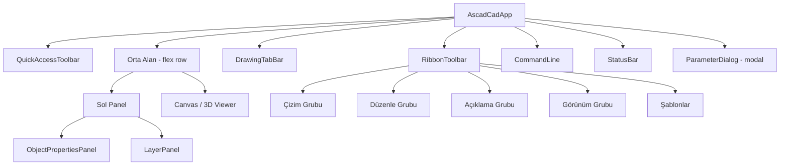
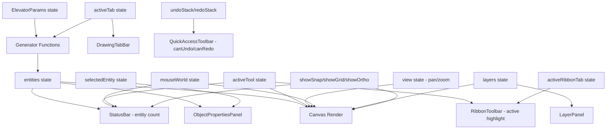

# Tasarım Dokümanı — AutoCAD Web UI Dönüşümü

## Genel Bakış

Bu tasarım, mevcut AscadCadApp.tsx (~3400 satır) tek dosya mimarisini koruyarak, AutoCAD Web (web.autocad.com) tarzı profesyonel bir koyu tema CAD arayüzüne dönüştürmeyi tanımlar. Dönüşüm mevcut tüm işlevselliği (çizim araçları, snap, ortho, polar tracking, entity seçimi, ölçü düzenleme, context menu, klavye kısayolları, undo/redo, export) koruyarak yalnızca UI katmanını yeniden yapılandırır.

Temel yaklaşım: Mevcut state yönetimi ve Canvas2D render mantığı korunur; yalnızca JSX layout yapısı ve inline style'lar yeni tasarıma göre güncellenir. Yeni sub-component'ler (RibbonToolbar, QuickAccessToolbar, ObjectPropertiesPanel vb.) dosya içinde tanımlanır.

## Mimari

### Mevcut Yapı

```
AscadCadApp (tek dosya)
├── Types & Interfaces (Point, CadEntity, ElevatorParams, LayerDef, SnapPoint)
├── Constants (DEFAULT_LAYERS, RAIL_PROFILES, BEYAN_TABLE, Colors)
├── Generator Functions (generateSingleCrossSection, generateLongitudinal, ...)
├── Helper Functions (moveEntity, rotateEntity90, mirrorEntityX, findSnapPoint, ...)
├── Sub-components (ParameterDialog, LayerPanel, DimEditPopup, ContextMenu)
└── Main Component (AscadCadApp)
    ├── State (params, entities, view, activeTool, activeTab, layers, ...)
    ├── Canvas render (useCallback)
    ├── Mouse/Keyboard handlers
    └── JSX Layout
```

### Hedef Yapı (Tek Dosya İçinde)

```
AscadCadApp.tsx
├── Types & Interfaces (mevcut + ThemeColors, RibbonTab, RibbonGroup)
├── Theme Constants (THEME objesi — tüm renk değerleri)
├── Mevcut Constants & Generators (değişiklik yok)
├── Yeni Sub-components (dosya içi)
│   ├── QuickAccessToolbar — üst sol: Yeni, Kaydet, Aç, Undo, Redo, Export, "ASNCAD" başlık
│   ├── RibbonToolbar — sekmeli araç çubuğu: Çizim, Düzenle, Açıklama, Görünüm + Şablonlar
│   ├── DrawingTabBar — 12 çizim sekmesi
│   ├── ObjectPropertiesPanel — seçili entity özellikleri
│   ├── LayerPanel (güncelleme) — katman yönetimi
│   ├── CommandLine — komut giriş alanı
│   └── StatusBar — koordinatlar, toggle'lar, Model/Layout tabları, bilgi
├── Mevcut Sub-components (ParameterDialog, DimEditPopup, ContextMenu)
└── Main Component (AscadCadApp)
    ├── State (mevcut + activeRibbonTab, leftPanelCollapsed, modelLayoutTab)
    ├── Canvas render (mevcut — crosshair güncelleme)
    ├── Mouse/Keyboard handlers (mevcut)
    └── Yeni JSX Layout
```

### Layout Yapısı

```
┌─────────────────────────────────────────────────────────┐
│ QuickAccessToolbar (Yeni, Kaydet, Aç, Undo, Redo, DXF, │
│ SVG, JSON | "ASNCAD")                                   │
├─────────────────────────────────────────────────────────┤
│ RibbonToolbar                                           │
│ [Çizim] [Düzenle] [Açıklama] [Görünüm] | [Şablonlar ▼]│
│ ┌─────────────────────────────────────────────────────┐ │
│ │ Aktif sekme araç grubu (ikon + etiket butonları)    │ │
│ └─────────────────────────────────────────────────────┘ │
├─────────────────────────────────────────────────────────┤
│ DrawingTabBar (12 sekme)                                │
├────────┬────────────────────────────────────────────────┤
│ Sol    │                                                │
│ Panel  │         Canvas Alanı                           │
│ ┌────┐ │         (veya 3D Viewer)                       │
│ │Obj │ │                                                │
│ │Prop│ │                                                │
│ ├────┤ │                                                │
│ │Lay │ │                                                │
│ │ers │ │                                                │
│ └────┘ │                                                │
├────────┴────────────────────────────────────────────────┤
│ CommandLine (Komut: ...)                                │
├─────────────────────────────────────────────────────────┤
│ StatusBar                                               │
│ [Model][Layout1] | X: ... Y: ... | SNAP GRID ORTHO |   │
│ tool | count | Q:800kg Kabin:... Kuyu:...               │
└─────────────────────────────────────────────────────────┘
```



## Bileşenler ve Arayüzler

### 1. Theme Sabitleri

```typescript
const THEME = {
  bg: '#1e1e2e',           // Ana arka plan
  panelBg: '#252536',      // Sol panel arka plan
  ribbonBg: '#2d2d3f',     // Ribbon arka plan
  canvasBg: '#0d0d1a',     // Canvas arka plan
  statusBg: '#1a1a2e',     // Status bar arka plan
  border: '#3d3d5c',       // Kenarlık rengi
  text: '#e2e8f0',         // Birincil metin
  textSecondary: '#94a3b8', // İkincil metin
  textMuted: '#64748b',    // Soluk metin
  accent: '#00b4d8',       // Vurgu rengi (aktif, seçili)
  accentHover: '#0ea5e9',  // Hover vurgu
  toolbarHover: '#3d3d5c', // Toolbar hover
  activeTabBg: '#1e1e2e',  // Aktif sekme arka plan
  buttonBg: 'transparent', // Buton varsayılan arka plan
  buttonActiveBg: '#00b4d820', // Aktif buton arka plan (yarı saydam)
  crosshair: '#ffffff33',  // Crosshair rengi
} as const;
```

### 2. QuickAccessToolbar

```typescript
interface QuickAccessToolbarProps {
  onNew: () => void;
  onSave: () => void;
  onOpen: () => void;
  onUndo: () => void;
  onRedo: () => void;
  onExportDXF: () => void;
  onExportSVG: () => void;
  onExportJSON: () => void;
  canUndo: boolean;
  canRedo: boolean;
}
```

Konum: Uygulamanın en üstünde, ribbon'ın üzerinde. Yükseklik ~32px.
İçerik: Yeni | Kaydet | Aç | Geri Al | Yinele | — | DXF | SVG | JSON | (boşluk) | "ASNCAD"
Geri Al/Yinele butonları `canUndo`/`canRedo` false olduğunda `opacity: 0.3` ve `pointerEvents: 'none'` ile devre dışı görünür.

### 3. RibbonToolbar

```typescript
type RibbonTabId = 'cizim' | 'duzenle' | 'aciklama' | 'gorunum';

interface RibbonToolDef {
  name: ToolName;
  icon: string;
  label: string;
}

interface RibbonGroupDef {
  id: RibbonTabId;
  label: string;
  tools: RibbonToolDef[];
}

interface RibbonToolbarProps {
  activeRibbonTab: RibbonTabId;
  onTabChange: (tab: RibbonTabId) => void;
  activeTool: ToolName;
  onToolSelect: (tool: ToolName) => void;
  onPreset: (preset: string) => void;
  onOpenParams: () => void;
}
```

Sekme grupları:
- **Çizim**: Çizgi (line), Dikdörtgen (rect), Daire (circle), Ölçü (dimension), Metin (text)
- **Düzenle**: Taşı (move), Kopyala (copy), Döndür (rotate), Ölçekle (scale), Aynala (mirror), Sil (delete action)
- **Açıklama**: Ölçü (dimension), Metin (text), Ölçü Düzenle (dd)
- **Görünüm**: Tümünü Göster (zoom extents), Izgara (grid toggle), Snap (snap toggle), Ortho (ortho toggle)

Sağ tarafta: Şablonlar bölümü (Konut, Ofis, Hastane, Otel butonları) + Parametreler (⚙) butonu.

Her araç butonu: üstte ikon (emoji/unicode), altında Türkçe etiket. Aktif araç `THEME.accent` rengiyle vurgulanır.

### 4. DrawingTabBar

```typescript
interface DrawingTabBarProps {
  activeTab: DrawingTab;
  onTabChange: (tab: DrawingTab) => void;
}
```

12 sekme yatay sırada. Aktif sekme: alt kenarlık `THEME.accent`, metin `THEME.text`. Pasif sekme: kenarlık yok, metin `THEME.textMuted`.

### 5. Sol Panel (ObjectPropertiesPanel + LayerPanel)

```typescript
interface ObjectPropertiesPanelProps {
  selectedEntity: CadEntity | null;
  collapsed: boolean;
  onToggle: () => void;
}

interface LayerPanelProps {
  layers: LayerDef[];
  onToggleVisibility: (name: string) => void;
  onToggleLock: (name: string) => void;
  collapsed: boolean;
  onToggle: () => void;
}
```

Sol panel genişliği: 260px (açık), ~36px (kapalı).
İki bağımsız daraltılabilir bölüm:
- **Object Properties**: Seçili entity varsa tip, katman, renk, koordinatlar gösterir. Yoksa "Nesne seçilmedi".
- **Layers**: Mevcut LayerPanel mantığı korunur, tema renkleri güncellenir.

Panel collapse: CSS `transition: width 0.2s ease` ile animasyonlu.

### 6. CommandLine

```typescript
interface CommandLineProps {
  value: string;
  onChange: (val: string) => void;
  onExecute: (cmd: string) => void;
}
```

Canvas ile StatusBar arasında konumlanır. "Komut:" etiketi + monospace input. Input rengi `THEME.accent`. Placeholder: "param, kk, dd, save, konut, ofis, hastane, otel, ze, dall, export-json, load"

### 7. StatusBar

```typescript
interface StatusBarProps {
  mouseWorld: Point;
  activeTool: ToolName;
  entityCount: number;
  showSnap: boolean;
  showGrid: boolean;
  showOrtho: boolean;
  onToggleSnap: () => void;
  onToggleGrid: () => void;
  onToggleOrtho: () => void;
  modelLayoutTab: 'model' | 'layout1';
  onModelLayoutChange: (tab: 'model' | 'layout1') => void;
  beyanYuk: number;
  kabinGen: number;
  kabinDer: number;
  kuyuGen: number;
  kuyuDer: number;
  statusInfo: string;
}
```

Sol: Model/Layout1 tabları. Orta: X/Y koordinatları (monospace). SNAP/GRID/ORTHO toggle butonları. Sağ: Aktif araç, eleman sayısı, Q:yük, Kabin boyutları, Kuyu boyutları.

### 8. Crosshair Cursor Güncellemesi

Mevcut `renderCrosshair` fonksiyonu güncellenir:
- Çizgi genişliği: 0.5px
- Renk: `#ffffff33` (yarı saydam beyaz)
- Canvas CSS cursor: çizim aracı aktifken `'none'`, select aracı aktifken `'crosshair'`

## Veri Modelleri

### Mevcut Veri Modelleri (Değişiklik Yok)

Aşağıdaki tipler ve arayüzler mevcut haliyle korunur:

- `Point`, `EntityType`, `DrawingTab`, `ToolName`
- `CadEntity`, `XData`, `ElevatorParams`, `KatBilgi`, `FirmaBilgi`
- `LayerDef`, `SnapPoint`

### Yeni State Değişkenleri

```typescript
// Ana bileşen içinde eklenen yeni state'ler:
const [activeRibbonTab, setActiveRibbonTab] = useState<RibbonTabId>('cizim');
const [leftPanelCollapsed, setLeftPanelCollapsed] = useState(false);
const [objPropsCollapsed, setObjPropsCollapsed] = useState(false);
const [layerSectionCollapsed, setLayerSectionCollapsed] = useState(false);
const [modelLayoutTab, setModelLayoutTab] = useState<'model' | 'layout1'>('model');
```

### Yeni Tip Tanımları

```typescript
type RibbonTabId = 'cizim' | 'duzenle' | 'aciklama' | 'gorunum';

interface RibbonToolDef {
  name: ToolName | 'delete' | 'zoom-extents' | 'grid-toggle' | 'snap-toggle' | 'ortho-toggle';
  icon: string;
  label: string;
  action?: () => void; // toggle/action butonları için
}

const RIBBON_GROUPS: Record<RibbonTabId, RibbonToolDef[]> = {
  cizim: [
    { name: 'line', icon: '╱', label: 'Çizgi' },
    { name: 'rect', icon: '▭', label: 'Dikdörtgen' },
    { name: 'circle', icon: '○', label: 'Daire' },
    { name: 'dimension', icon: '↔', label: 'Ölçü' },
    { name: 'text', icon: 'A', label: 'Metin' },
  ],
  duzenle: [
    { name: 'move', icon: '✥', label: 'Taşı' },
    { name: 'copy', icon: '⧉', label: 'Kopyala' },
    { name: 'rotate', icon: '↻', label: 'Döndür' },
    { name: 'scale', icon: '⤢', label: 'Ölçekle' },
    { name: 'mirror', icon: '⇿', label: 'Aynala' },
    { name: 'delete', icon: '🗑', label: 'Sil' },
  ],
  aciklama: [
    { name: 'dimension', icon: '↔', label: 'Ölçü' },
    { name: 'text', icon: 'A', label: 'Metin' },
    { name: 'dd', icon: 'DD', label: 'Ölçü Düzenle' },
  ],
  gorunum: [
    { name: 'zoom-extents', icon: '⊞', label: 'Tümünü Göster' },
    { name: 'grid-toggle', icon: '▦', label: 'Izgara' },
    { name: 'snap-toggle', icon: '⊕', label: 'Snap' },
    { name: 'ortho-toggle', icon: '⊥', label: 'Ortho' },
  ],
};
```

### Veri Akışı




## Doğruluk Özellikleri (Correctness Properties)

*Bir özellik (property), bir sistemin tüm geçerli yürütmelerinde doğru olması gereken bir davranış veya karakteristiktir — esasen, sistemin ne yapması gerektiğine dair biçimsel bir ifadedir. Özellikler, insan tarafından okunabilir spesifikasyonlar ile makine tarafından doğrulanabilir doğruluk garantileri arasındaki köprü görevi görür.*

### Property 1: Ribbon Sekme Değiştirme

*For any* ribbon tab ID from the set {cizim, duzenle, aciklama, gorunum}, when that tab is clicked, the RibbonToolbar SHALL display the corresponding tool group panel containing exactly the tools defined for that tab in RIBBON_GROUPS.

**Validates: Requirements 2.2**

### Property 2: Aktif Araç Vurgusu

*For any* tool button in the RibbonToolbar, when that tool is the activeTool, the button SHALL be rendered with the accent color (#00b4d8) styling, and all other tool buttons SHALL NOT have accent styling.

**Validates: Requirements 2.7**

### Property 3: Entity Özellik Gösterimi

*For any* CadEntity with valid type, layer, color, and coordinate fields, when that entity is the selectedEntity, the ObjectPropertiesPanel SHALL display strings containing the entity's type, layer name, color value, and at least one coordinate value.

**Validates: Requirements 4.3**

### Property 4: Katman Bilgi Gösterimi

*For any* array of LayerDef objects, the LayerPanel SHALL render a row for each layer containing the layer's name text, a color indicator matching the layer's color, a visibility toggle icon, and a lock toggle icon.

**Validates: Requirements 4.5**

### Property 5: Katman Toggle İşlemi

*For any* LayerDef in the layers array and any toggle type (visibility or lock), clicking the corresponding toggle SHALL flip that boolean field while leaving all other layer properties and all other layers unchanged.

**Validates: Requirements 4.6, 4.7**

### Property 6: Status Bar Durum Gösterimi

*For any* application state consisting of mouseWorld coordinates, activeTool name, entity count, showSnap/showGrid/showOrtho booleans, beyanYuk, kabinGen, kabinDer, kuyuGen, and kuyuDer values, the StatusBar SHALL display formatted strings containing all of these values.

**Validates: Requirements 5.4, 5.5, 5.7, 5.8**

### Property 7: Çizim Yardımcısı Toggle

*For any* drawing aid toggle (SNAP, GRID, ORTHO), clicking the toggle button SHALL flip the corresponding boolean state (showSnap, showGrid, showOrtho) and the visual state of the button SHALL reflect the new boolean value.

**Validates: Requirements 5.6**

### Property 8: Komut Yürütme

*For any* valid command string from the supported command set {param, kk, dd, save, konut, ofis, hastane, otel, ze, dall, export-json, load}, when entered in the CommandLine and Enter is pressed, the system SHALL execute the corresponding action (open dialog, switch tab, change tool, save/load, apply preset, zoom extents, delete user entities, export).

**Validates: Requirements 6.3**

### Property 9: Crosshair Render

*For any* cursor position (x, y) within the canvas bounds, the renderCrosshair function SHALL draw a horizontal line spanning the full canvas width at y and a vertical line spanning the full canvas height at x, using lineWidth 0.5 and strokeStyle '#ffffff33'.

**Validates: Requirements 7.1, 7.2**

### Property 10: Çizim Aracı Cursor Stili

*For any* active drawing tool from the set {line, rect, circle, dimension, text}, the canvas element's CSS cursor property SHALL be 'none', and when the active tool is 'select', the cursor SHALL be 'crosshair'.

**Validates: Requirements 7.3, 7.4**

### Property 11: Çizim Sekmesi Değiştirme

*For any* DrawingTab from the 12 defined tabs, when that tab is clicked, the activeTab state SHALL be set to the corresponding tab key, and the clicked tab SHALL be rendered with accent bottom border and brighter text color while all other tabs SHALL have muted styling.

**Validates: Requirements 8.3, 8.4**

### Property 12: Şablon Parametre Yükleme

*For any* preset from the set {konut, ofis, hastane, otel}, when the preset button is clicked, the ElevatorParams state SHALL be updated with the predefined values for that preset (binaKullanimTipi, kuyuGen, kuyuDer, kapiGen, katlar, etc.) and all drawings SHALL be regenerated.

**Validates: Requirements 9.3**

## Hata Yönetimi

### Genel Yaklaşım

UI dönüşümü mevcut hata yönetimi mekanizmalarını korur. Ek hata senaryoları:

1. **Geçersiz komut girişi**: CommandLine'da tanınmayan komut girildiğinde sessizce yok sayılır (mevcut `default: break` davranışı korunur).

2. **Boş entity seçimi**: selectedEntity null olduğunda ObjectPropertiesPanel "Nesne seçilmedi" mesajı gösterir.

3. **Undo/Redo stack boş**: QuickAccessToolbar'da ilgili butonlar devre dışı görünür (`opacity: 0.3`, `pointerEvents: 'none'`).

4. **Canvas boyut değişikliği**: Mevcut ResizeObserver mekanizması korunur, yeni layout'ta flex yapısı sayesinde canvas otomatik yeniden boyutlanır.

5. **Sol panel collapse/expand**: CSS transition ile animasyonlu geçiş. Panel kapalıyken içerik render edilmez (performans).

6. **3D Görünüm sekmesi**: activeTab '3d-gorunum' olduğunda canvas yerine Elevator3DViewer render edilir, canvas event handler'ları devre dışı kalır.

## Test Stratejisi

### Genel Yaklaşım

Bu özellik UI dönüşümü olduğundan, test stratejisi iki katmanlıdır:

1. **Property-Based Tests (PBT)**: Evrensel özellikler — tüm geçerli girdiler üzerinde doğruluk garantisi
2. **Example-Based Unit Tests**: Belirli senaryolar, kenar durumları, statik yapı kontrolleri

### Property-Based Testing

- **Kütüphane**: `fast-check` (projede zaten mevcut — package.json'da `"fast-check": "^4.6.0"`)
- **Test runner**: `vitest` (projede zaten mevcut — `"vitest": "^4.1.4"`)
- **Minimum iterasyon**: Her property testi en az 100 iterasyon çalıştırır
- **Etiket formatı**: `Feature: autocad-web-ui, Property {number}: {property_text}`
- **Her correctness property tek bir property-based test ile implemente edilir**

### PBT Uygulanacak Alanlar

| Property | Test Edilecek Fonksiyon/Bileşen | Generator |
|----------|-------------------------------|-----------|
| 1 — Ribbon Sekme | RibbonToolbar render | `fc.constantFrom('cizim', 'duzenle', 'aciklama', 'gorunum')` |
| 2 — Aktif Araç Vurgusu | RibbonToolbar button styles | `fc.constantFrom(...allToolNames)` |
| 3 — Entity Özellik | ObjectPropertiesPanel render | `fc.record({type, layer, color, coords})` |
| 4 — Katman Bilgi | LayerPanel render | `fc.array(fc.record({name, color, visible, locked}))` |
| 5 — Katman Toggle | Layer state update logic | `fc.record({layerName, toggleType})` |
| 6 — Status Bar | StatusBar render | `fc.record({mouseWorld, activeTool, entityCount, toggles, params})` |
| 7 — Çizim Yardımcısı | Toggle state logic | `fc.constantFrom('snap', 'grid', 'ortho')` |
| 8 — Komut Yürütme | handleCommand function | `fc.constantFrom(...validCommands)` |
| 9 — Crosshair | renderCrosshair function | `fc.record({x: fc.float(), y: fc.float(), width: fc.nat(), height: fc.nat()})` |
| 10 — Cursor Stili | Canvas cursor logic | `fc.constantFrom(...drawingTools, 'select')` |
| 11 — Çizim Sekmesi | DrawingTabBar + activeTab | `fc.constantFrom(...allDrawingTabs)` |
| 12 — Şablon Parametre | handleCommand preset logic | `fc.constantFrom('konut', 'ofis', 'hastane', 'otel')` |

### Example-Based Unit Tests

Aşağıdaki kabul kriterleri example-based testlerle doğrulanır:

- **Tema renkleri** (1.1–1.7): Her bileşenin doğru arka plan/kenarlık/metin rengini kullandığını doğrulayan snapshot veya style assertion testleri
- **Yapısal kontroller** (2.1, 2.3–2.6, 2.8): Ribbon gruplarının doğru araçları içerdiğini doğrulayan testler
- **QAT yapısı** (3.1–3.6): QuickAccessToolbar'ın doğru butonları ve "ASNCAD" başlığını içerdiğini doğrulayan testler
- **Panel yapısı** (4.1, 4.2, 4.4, 4.8, 4.9): Sol panel genişliği, bölüm yapısı, collapse animasyonu
- **Status bar yapısı** (5.1–5.3): Model/Layout tabları, konum, vurgu
- **Command line yapısı** (6.1, 6.2, 6.4, 6.5): Konum, etiket, font, placeholder
- **Crosshair CSS** (7.2, 7.4): Çizgi genişliği, renk, select cursor
- **Drawing tab yapısı** (8.1, 8.2, 8.5): 12 sekme varlığı, 3D görünüm geçişi
- **Şablon yapısı** (9.1, 9.2, 9.4): Şablon butonları, Parametreler butonu
- **Layout** (10.1, 10.2): Flex yapısı, panel collapse sonrası canvas genişlemesi
