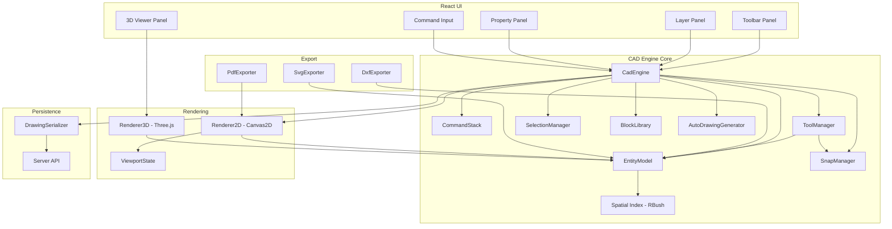
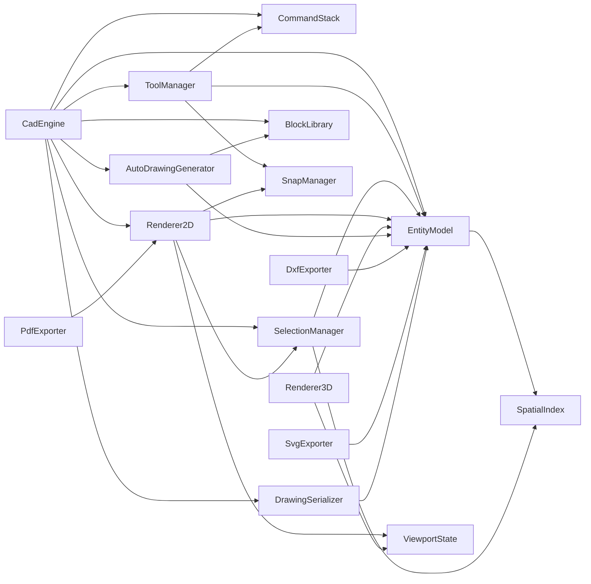
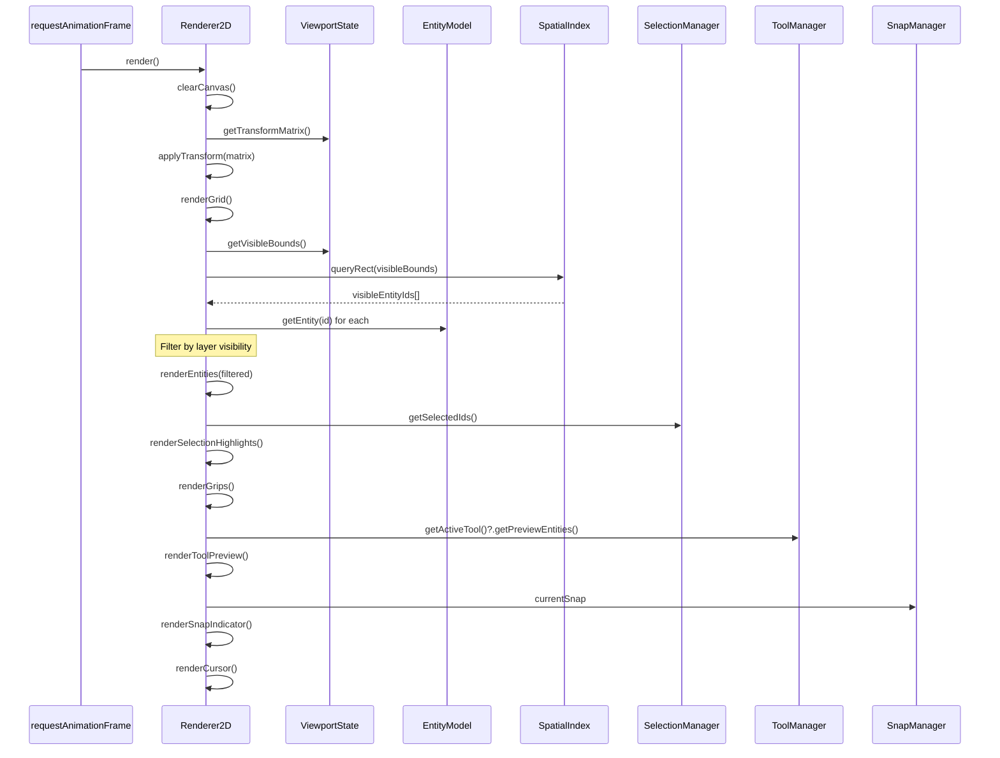
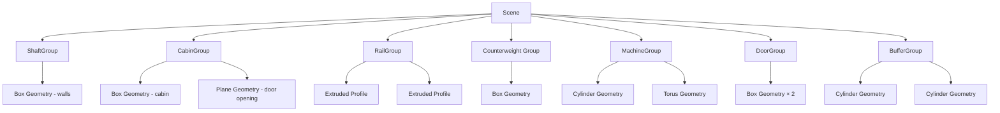
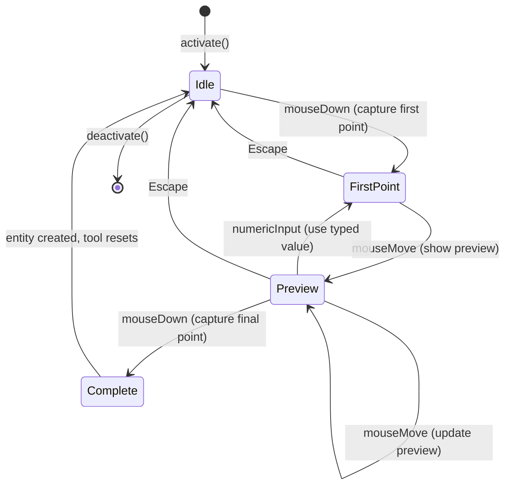
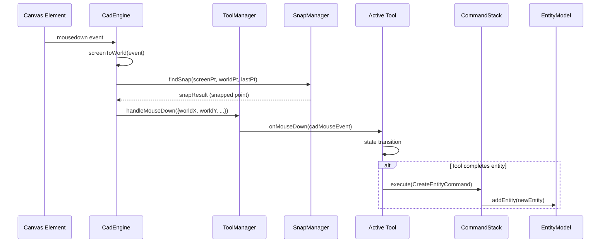
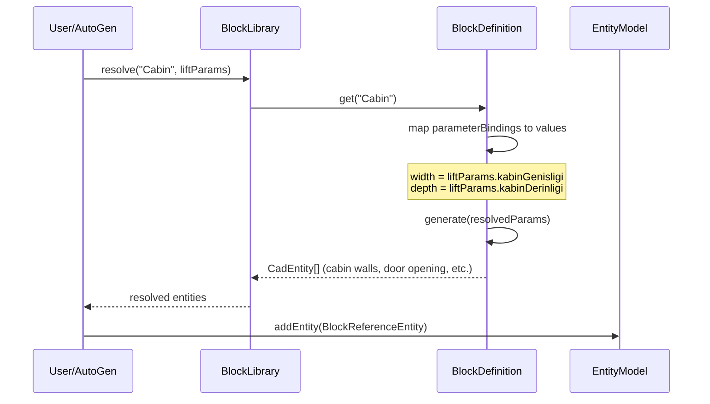
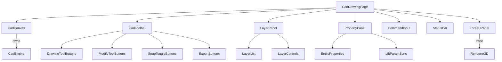

# Design Document — Interactive Web CAD Drawing Engine

## Overview

This design replaces the existing server-side SVG generation (`DrawingGeneratorService.cs` → `dangerouslySetInnerHTML` in `DrawingViewer.tsx`) with a fully interactive client-side CAD engine. The current system generates static SVG strings on the backend and renders them as non-interactive HTML. The new system moves all drawing logic to the browser, providing a ZwCAD-like experience with pan, zoom, snap, drawing tools, parametric blocks, undo/redo, layer management, 3D visualization, and DXF/PDF/SVG export.

The CAD engine is a standalone TypeScript module (`@/cad/`) that integrates into the existing React 18 + Vite frontend. It owns an HTML5 Canvas element and manages its own render loop, entity model, and input handling. React components wrap the engine for toolbar UI, layer panel, property panel, and command input. The engine communicates with the existing ASP.NET Core backend via new REST endpoints for drawing persistence (JSON).

### Key Design Decisions

1. **Canvas2D over WebGL for 2D**: Canvas2D is simpler, has no shader complexity, and handles 10K entities at 30fps with proper culling. WebGL would add complexity without proportional benefit for 2D CAD at this scale.
2. **Three.js for 3D**: Industry-standard, well-documented, handles orbit controls and section planes out of the box.
3. **Standalone engine, not React state**: The CAD engine manages its own state and render loop. React wraps it for UI panels but does not own entity state. This avoids React re-render overhead on every mouse move.
4. **Command pattern for undo/redo**: Every mutation is a `Command` object with `execute()` and `undo()`. This is the standard CAD undo architecture.
5. **R-tree spatial index**: Enables O(log n) hit-testing and viewport culling. The `rbush` library provides a battle-tested R-tree implementation.
6. **Client-side DXF generation**: DXF is a text format. Generating it client-side avoids server round-trips and keeps the export instant. The `dxf-writer` pattern is straightforward string building.
7. **JSON drawing format**: The entity model serializes to JSON for server persistence. This is simpler than binary formats and allows easy debugging and migration.
8. **fast-check for property-based testing**: TypeScript-native PBT library, integrates with Vitest, supports custom arbitraries for CAD entity generation.

---

## Architecture

### High-Level Architecture



### Module Dependency Graph



### File Structure

```
ascad-web/client/src/cad/
├── core/
│   ├── CadEngine.ts              # Main orchestrator
│   ├── EntityModel.ts            # Entity storage + spatial index
│   ├── SpatialIndex.ts           # R-tree wrapper (rbush)
│   ├── CommandStack.ts           # Undo/redo command history
│   ├── SelectionManager.ts       # Selection set management
│   └── types.ts                  # All CAD entity interfaces
├── rendering/
│   ├── Renderer2D.ts             # Canvas2D rendering pipeline
│   ├── Renderer3D.ts             # Three.js 3D viewer
│   ├── ViewportState.ts          # Pan/zoom/transform state
│   ├── GridRenderer.ts           # Grid drawing
│   ├── EntityRenderers.ts        # Per-type entity rendering
│   └── CursorRenderer.ts        # Crosshair + snap indicators
├── tools/
│   ├── ToolManager.ts            # Tool activation + input routing
│   ├── SnapManager.ts            # Snap point detection
│   ├── BaseTool.ts               # Abstract tool base class
│   ├── LineTool.ts
│   ├── PolylineTool.ts
│   ├── RectangleTool.ts
│   ├── CircleTool.ts
│   ├── ArcTool.ts
│   ├── DimensionTool.ts
│   ├── TextTool.ts
│   ├── SelectTool.ts
│   ├── MoveTool.ts
│   ├── CopyTool.ts
│   ├── RotateTool.ts
│   ├── ScaleTool.ts
│   ├── MirrorTool.ts
│   └── OffsetTool.ts
├── blocks/
│   ├── BlockLibrary.ts           # Block definition registry
│   ├── BlockDefinition.ts        # Parametric block base
│   ├── CabinBlock.ts             # Cabin parametric block
│   ├── GuideRailBlock.ts
│   ├── DoorBlock.ts
│   ├── CounterweightBlock.ts
│   ├── TractionMachineBlock.ts
│   ├── BufferBlock.ts
│   ├── SafetyGearBlock.ts
│   ├── GovernorBlock.ts
│   └── ControlPanelBlock.ts
├── generation/
│   ├── AutoDrawingGenerator.ts   # Orchestrates auto-generation
│   ├── CrossSectionGenerator.ts
│   ├── LongitudinalGenerator.ts
│   ├── MachineRoomGenerator.ts
│   ├── CabinPlanGenerator.ts
│   ├── PitDetailGenerator.ts
│   └── OverheadDetailGenerator.ts
├── export/
│   ├── DxfExporter.ts            # DXF file generation
│   ├── PdfExporter.ts            # PDF via canvas-to-pdf
│   ├── SvgExporter.ts            # SVG string generation
│   └── dxf/
│       ├── DxfWriter.ts          # Low-level DXF string builder
│       ├── DxfEntityMapper.ts    # CadEntity → DXF entity mapping
│       └── DxfLayerMapper.ts     # Layer → DXF layer table
├── persistence/
│   ├── DrawingSerializer.ts      # JSON serialization/deserialization
│   └── DrawingApiClient.ts       # Server API calls
├── react/
│   ├── CadCanvas.tsx             # React wrapper for 2D canvas
│   ├── ThreeDViewer.tsx          # React wrapper for 3D viewer
│   ├── CadToolbar.tsx            # Drawing tool buttons
│   ├── LayerPanel.tsx            # Layer list + controls
│   ├── PropertyPanel.tsx         # Selected entity properties
│   ├── CommandInput.tsx          # Command line input
│   ├── StatusBar.tsx             # Coordinate readout + prompts
│   └── CadDrawingPage.tsx        # Full page layout replacing DrawingViewer
└── __tests__/
    ├── EntityModel.test.ts
    ├── DrawingSerializer.test.ts
    ├── DxfExporter.test.ts
    ├── ViewportState.test.ts
    ├── SnapManager.test.ts
    ├── CommandStack.test.ts
    ├── SelectionManager.test.ts
    ├── BlockLibrary.test.ts
    ├── AutoDrawingGenerator.test.ts
    └── properties/
        ├── serialization.property.test.ts
        ├── viewport.property.test.ts
        ├── dxf.property.test.ts
        ├── snap.property.test.ts
        ├── command.property.test.ts
        ├── selection.property.test.ts
        ├── layer.property.test.ts
        ├── block.property.test.ts
        └── generation.property.test.ts
```


---

## Components and Interfaces

### CadEngine (Main Orchestrator)

The central coordinator. Owns all subsystems, handles lifecycle, and exposes the public API that React components call.

```typescript
class CadEngine {
  readonly entityModel: EntityModel;
  readonly commandStack: CommandStack;
  readonly toolManager: ToolManager;
  readonly selectionManager: SelectionManager;
  readonly snapManager: SnapManager;
  readonly blockLibrary: BlockLibrary;
  readonly renderer2D: Renderer2D;
  readonly viewportState: ViewportState;
  readonly drawingSerializer: DrawingSerializer;

  constructor(canvas: HTMLCanvasElement, liftParams: LiftParams);

  // Lifecycle
  initialize(): void;
  dispose(): void;

  // Drawing tools
  activateTool(toolName: ToolName): void;
  cancelCurrentTool(): void;

  // Commands
  undo(): void;
  redo(): void;

  // Selection
  deleteSelected(): void;
  moveSelected(dx: number, dy: number): void;
  copySelected(dx: number, dy: number): void;
  rotateSelected(centerX: number, centerY: number, angleDeg: number): void;
  scaleSelected(centerX: number, centerY: number, factor: number): void;
  mirrorSelected(p1: Point2D, p2: Point2D): void;

  // Layers
  setActiveLayer(layerName: string): void;
  setLayerVisibility(layerName: string, visible: boolean): void;
  setLayerLock(layerName: string, locked: boolean): void;

  // Blocks
  insertBlock(defName: string, insertionPoint: Point2D, rotation?: number): void;

  // Auto-generation
  generateDrawing(type: DrawingType): void;

  // Persistence
  serialize(): DrawingJson;
  deserialize(json: DrawingJson): void;

  // Export
  exportDxf(): string;
  exportSvg(): string;
  exportPdf(scale: PdfScale): Promise<Blob>;

  // Parameter sync
  updateLiftParams(params: Partial<LiftParams>): void;

  // Events
  on(event: CadEvent, handler: CadEventHandler): void;
  off(event: CadEvent, handler: CadEventHandler): void;
}
```

### EntityModel

Stores all entities, manages layers, and maintains the spatial index. This is the single source of truth for drawing data.

```typescript
class EntityModel {
  private entities: Map<string, CadEntity>;
  private layers: Map<string, Layer>;
  private blockDefs: Map<string, BlockDefinition>;
  private spatialIndex: SpatialIndex;

  // Entity CRUD
  addEntity(entity: CadEntity): void;
  removeEntity(id: string): CadEntity | undefined;
  getEntity(id: string): CadEntity | undefined;
  updateEntity(id: string, updates: Partial<CadEntity>): void;
  getAllEntities(): CadEntity[];
  getEntitiesByLayer(layerName: string): CadEntity[];

  // Spatial queries
  queryRect(bounds: BoundingBox): CadEntity[];
  queryPoint(point: Point2D, tolerance: number): CadEntity[];
  hitTest(point: Point2D, tolerance: number): CadEntity | undefined;

  // Layer management
  addLayer(layer: Layer): void;
  removeLayer(name: string): boolean;
  getLayer(name: string): Layer | undefined;
  getAllLayers(): Layer[];
  setActiveLayer(name: string): void;
  getActiveLayer(): Layer;

  // Block definitions
  addBlockDef(def: BlockDefinition): void;
  getBlockDef(name: string): BlockDefinition | undefined;
  getAllBlockDefs(): BlockDefinition[];

  // Bulk operations
  getVisibleEntities(): CadEntity[];
  getEntityCount(): number;
  clear(): void;
}
```

### CommandStack

Implements the Command pattern for undo/redo. Each command captures the forward and reverse operations.

```typescript
interface Command {
  readonly description: string;
  execute(): void;
  undo(): void;
}

class CommandStack {
  private undoStack: Command[];
  private redoStack: Command[];
  private maxLevels: number; // default 100

  execute(command: Command): void;
  undo(): boolean;
  redo(): boolean;
  canUndo(): boolean;
  canRedo(): boolean;
  clear(): void;

  // Group multiple sub-operations into one undoable unit
  beginGroup(description: string): void;
  endGroup(): void;
}
```

### ToolManager

Manages the active drawing tool and routes input events to it.

```typescript
class ToolManager {
  private activeTool: BaseTool | null;
  private tools: Map<ToolName, BaseTool>;

  activateTool(name: ToolName): void;
  deactivateTool(): void;
  getActiveTool(): BaseTool | null;

  // Input routing (called by CadEngine from canvas events)
  handleMouseDown(event: CadMouseEvent): void;
  handleMouseMove(event: CadMouseEvent): void;
  handleMouseUp(event: CadMouseEvent): void;
  handleKeyDown(event: KeyboardEvent): void;
  handleNumericInput(value: number): void;
}

abstract class BaseTool {
  abstract readonly name: ToolName;
  abstract readonly prompt: string;

  protected engine: CadEngine;
  protected state: ToolState; // 'idle' | 'first_point' | 'preview' | 'complete'

  abstract onMouseDown(event: CadMouseEvent): void;
  abstract onMouseMove(event: CadMouseEvent): void;
  abstract onMouseUp(event: CadMouseEvent): void;
  abstract onKeyDown(event: KeyboardEvent): void;
  abstract onNumericInput(value: number): void;
  abstract getPreviewEntities(): CadEntity[];

  activate(): void;
  deactivate(): void;
  cancel(): void;
}
```

### SnapManager

Detects snap points on existing geometry within an aperture radius.

```typescript
class SnapManager {
  private enabledModes: Set<SnapMode>;
  private apertureRadius: number; // default 10 pixels
  private orthoEnabled: boolean;

  findSnap(screenPoint: Point2D, worldPoint: Point2D, lastPoint?: Point2D): SnapResult | null;

  setMode(mode: SnapMode, enabled: boolean): void;
  setApertureRadius(pixels: number): void;
  setOrthoEnabled(enabled: boolean): void;
  isOrthoEnabled(): boolean;

  // Applies ortho constraint to a point relative to lastPoint
  applyOrtho(point: Point2D, lastPoint: Point2D): Point2D;
}

interface SnapResult {
  point: Point2D;
  mode: SnapMode;
  entityId?: string;
}

type SnapMode = 'endpoint' | 'midpoint' | 'center' | 'intersection' | 'perpendicular' | 'nearest' | 'grid';
```

### SelectionManager

Manages the current selection set and provides selection operations.

```typescript
class SelectionManager {
  private selected: Set<string>; // entity IDs

  // Selection operations
  selectEntity(id: string): void;
  deselectEntity(id: string): void;
  toggleEntity(id: string): void;
  selectAll(): void;
  clearSelection(): void;

  // Box selection
  selectByWindow(bounds: BoundingBox): void;   // fully contained
  selectByCrossing(bounds: BoundingBox): void;  // intersecting

  // Query
  getSelectedIds(): string[];
  getSelectedEntities(): CadEntity[];
  isSelected(id: string): boolean;
  getSelectionCount(): number;

  // Grips
  getGripPoints(): GripPoint[];
}
```

### Renderer2D

Renders entities to the Canvas2D context with viewport transformation.

```typescript
class Renderer2D {
  private ctx: CanvasRenderingContext2D;
  private viewport: ViewportState;
  private entityModel: EntityModel;
  private selectionManager: SelectionManager;
  private snapManager: SnapManager;
  private gridRenderer: GridRenderer;
  private cursorRenderer: CursorRenderer;

  render(): void; // Full frame render

  // Render pipeline steps (called in order by render())
  private renderGrid(): void;
  private renderEntities(): void;
  private renderSelectionHighlights(): void;
  private renderGrips(): void;
  private renderToolPreview(previewEntities: CadEntity[]): void;
  private renderSnapIndicator(snap: SnapResult | null): void;
  private renderCursor(worldPos: Point2D): void;

  // Entity rendering dispatch
  private renderEntity(entity: CadEntity): void;
  private renderLine(entity: LineEntity): void;
  private renderPolyline(entity: PolylineEntity): void;
  private renderCircle(entity: CircleEntity): void;
  private renderArc(entity: ArcEntity): void;
  private renderDimension(entity: DimensionEntity): void;
  private renderText(entity: TextEntity): void;
  private renderHatch(entity: HatchEntity): void;
  private renderBlockRef(entity: BlockReferenceEntity): void;

  requestRender(): void; // Schedules a render via requestAnimationFrame
}
```

### ViewportState

Manages the 2D viewport transform (world ↔ screen coordinate conversion).

```typescript
class ViewportState {
  centerX: number;   // world X at screen center
  centerY: number;   // world Y at screen center
  zoom: number;      // pixels per world unit
  canvasWidth: number;
  canvasHeight: number;

  static readonly MIN_ZOOM = 0.01;
  static readonly MAX_ZOOM = 100;

  // Coordinate transforms
  worldToScreen(wx: number, wy: number): Point2D;
  screenToWorld(sx: number, sy: number): Point2D;

  // Viewport manipulation
  pan(screenDx: number, screenDy: number): void;
  zoomAt(screenX: number, screenY: number, factor: number): void;
  zoomExtents(bounds: BoundingBox, margin?: number): void;

  // Query
  getVisibleBounds(): BoundingBox;
  getTransformMatrix(): DOMMatrix;
}
```

### BlockLibrary

Registry of parametric block definitions for elevator components.

```typescript
class BlockLibrary {
  private definitions: Map<string, ParametricBlockDef>;

  register(def: ParametricBlockDef): void;
  get(name: string): ParametricBlockDef | undefined;
  getAll(): ParametricBlockDef[];

  // Resolve a block definition with specific parameters
  resolve(name: string, params: LiftParams): CadEntity[];

  // Register built-in elevator component blocks
  registerBuiltins(): void;
}

interface ParametricBlockDef {
  name: string;
  displayName: string;
  parameterBindings: Record<string, string>; // e.g., { width: 'KabinGenisligi' }
  generate(params: Record<string, number>): CadEntity[];
  attributeDefinitions: BlockAttributeDef[];
}
```

### AutoDrawingGenerator

Generates complete technical drawings from Lift parameters by composing entities and block references.

```typescript
class AutoDrawingGenerator {
  constructor(
    private entityModel: EntityModel,
    private blockLibrary: BlockLibrary
  );

  generateCrossSection(params: LiftParams): GenerationResult;
  generateLongitudinalSection(params: LiftParams): GenerationResult;
  generateMachineRoom(params: LiftParams): GenerationResult;
  generateCabinPlan(params: LiftParams): GenerationResult;
  generatePitDetail(params: LiftParams): GenerationResult;
  generateOverheadDetail(params: LiftParams): GenerationResult;

  // Returns entity IDs that were auto-generated (for parameter mapping)
  getAutoGeneratedEntityIds(): string[];

  // Maps entity IDs to the Lift parameter that controls them
  getParameterMapping(): Map<string, string>;
}

interface GenerationResult {
  entities: CadEntity[];
  parameterMap: Map<string, string>; // entityId → paramName
}
```

### DrawingSerializer

Converts the entity model to/from JSON for server persistence.

```typescript
class DrawingSerializer {
  serialize(model: EntityModel, viewport: ViewportState): DrawingJson;
  deserialize(json: DrawingJson, model: EntityModel, viewport: ViewportState): void;

  // Individual entity serialization (used by serialize/deserialize)
  serializeEntity(entity: CadEntity): EntityJson;
  deserializeEntity(json: EntityJson): CadEntity;

  serializeLayer(layer: Layer): LayerJson;
  deserializeLayer(json: LayerJson): Layer;

  serializeBlockDef(def: BlockDefinition): BlockDefJson;
  deserializeBlockDef(json: BlockDefJson): BlockDefinition;
}
```

### DxfExporter

Generates DXF files from the entity model.

```typescript
class DxfExporter {
  export(model: EntityModel): string;

  // Section generators
  private writeHeader(): string;
  private writeTables(layers: Layer[]): string;
  private writeBlocks(blockDefs: BlockDefinition[]): string;
  private writeEntities(entities: CadEntity[]): string;

  // Entity mappers
  mapLine(entity: LineEntity): string;
  mapCircle(entity: CircleEntity): string;
  mapArc(entity: ArcEntity): string;
  mapPolyline(entity: PolylineEntity): string;
  mapText(entity: TextEntity): string;
  mapDimension(entity: DimensionEntity): string;
  mapBlockRef(entity: BlockReferenceEntity): string;
  mapHatch(entity: HatchEntity): string;

  // Layer table entry
  mapLayer(layer: Layer): string;
}
```

### Renderer3D

Three.js-based 3D visualization of the elevator shaft.

```typescript
class Renderer3D {
  private scene: THREE.Scene;
  private camera: THREE.PerspectiveCamera;
  private renderer: THREE.WebGLRenderer;
  private controls: OrbitControls;
  private sectionPlane: THREE.Plane | null;

  constructor(container: HTMLElement);

  // Lifecycle
  initialize(): void;
  dispose(): void;

  // Model building
  buildFromParams(params: LiftParams): void;
  updateParams(params: Partial<LiftParams>): void;

  // Component visibility
  setComponentVisible(component: ComponentCategory, visible: boolean): void;

  // Render modes
  setRenderMode(mode: 'wireframe' | 'solid' | 'transparent'): void;

  // Section plane
  setSectionPlane(height: number | null): void;

  // Camera
  resetCamera(): void;
}

type ComponentCategory = 'shaft' | 'cabin' | 'rails' | 'counterweight' | 'machine' | 'doors' | 'buffers';
```


---

## Data Models

### Core Geometry Types

```typescript
interface Point2D {
  x: number;
  y: number;
}

interface BoundingBox {
  minX: number;
  minY: number;
  maxX: number;
  maxY: number;
}

interface Transform2D {
  translateX: number;
  translateY: number;
  rotation: number;    // radians
  scaleX: number;
  scaleY: number;
}
```

### Base Entity

```typescript
type EntityType =
  | 'line' | 'polyline' | 'circle' | 'arc'
  | 'dimension' | 'text' | 'hatch' | 'block_reference';

type LineType = 'continuous' | 'dashed' | 'center' | 'hidden';

interface CadEntity {
  id: string;                  // UUID
  type: EntityType;
  layerName: string;
  color: string;               // hex color, e.g. '#FF0000'
  lineType: LineType;
  lineWeight: number;          // mm
  visible: boolean;
  locked: boolean;
  // Auto-generation tracking
  autoGenerated: boolean;
  sourceParam?: string;        // Lift parameter name that controls this entity
}
```

### Geometry Entities

```typescript
interface LineEntity extends CadEntity {
  type: 'line';
  start: Point2D;
  end: Point2D;
}

interface PolylineEntity extends CadEntity {
  type: 'polyline';
  vertices: Point2D[];
  closed: boolean;
}

interface CircleEntity extends CadEntity {
  type: 'circle';
  center: Point2D;
  radius: number;
}

interface ArcEntity extends CadEntity {
  type: 'arc';
  center: Point2D;
  radius: number;
  startAngle: number;   // radians
  endAngle: number;      // radians
}
```

### Annotation Entities

```typescript
type DimensionType = 'linear' | 'aligned' | 'angular' | 'radial';

interface DimensionEntity extends CadEntity {
  type: 'dimension';
  dimensionType: DimensionType;
  defPoint1: Point2D;          // first definition point
  defPoint2: Point2D;          // second definition point
  dimLinePoint: Point2D;       // dimension line position
  measurementValue: number;    // computed measurement in mm or degrees
  textOverride?: string;       // optional manual text override
  textHeight: number;          // mm
  arrowSize: number;           // mm
  extensionLineOffset: number; // mm
  decimalPrecision: number;    // number of decimal places
  // For angular dimensions
  angleVertex?: Point2D;
  // For radial dimensions
  centerPoint?: Point2D;
}

interface TextEntity extends CadEntity {
  type: 'text';
  position: Point2D;
  content: string;
  fontSize: number;            // mm
  fontFamily: string;
  fontWeight: 'normal' | 'bold';
  fontStyle: 'normal' | 'italic';
  alignment: 'left' | 'center' | 'right';
  rotation: number;            // radians
}

type HatchPattern = 'ANSI31' | 'ANSI32' | 'INSUL' | 'SOLID';

interface HatchEntity extends CadEntity {
  type: 'hatch';
  pattern: HatchPattern;
  patternScale: number;
  patternAngle: number;        // radians
  boundaryEntityIds: string[]; // IDs of entities forming the closed boundary
  boundaryPoints: Point2D[];   // computed boundary polygon
}
```

### Block System

```typescript
interface BlockDefinition {
  name: string;
  displayName: string;
  basePoint: Point2D;
  entities: CadEntity[];       // geometry that makes up the block
  attributeDefs: BlockAttributeDef[];
  parameterBindings: Record<string, string>; // paramName → liftParamName
}

interface BlockAttributeDef {
  tag: string;                 // attribute tag name
  prompt: string;              // prompt text
  defaultValue: string;
  position: Point2D;           // relative to block base point
  textHeight: number;
  visible: boolean;
}

interface BlockReferenceEntity extends CadEntity {
  type: 'block_reference';
  blockDefName: string;
  insertionPoint: Point2D;
  rotation: number;            // radians
  scaleX: number;
  scaleY: number;
  attributes: Record<string, string>; // tag → value
}
```

### Layer

```typescript
interface Layer {
  name: string;
  visible: boolean;
  locked: boolean;
  color: string;               // hex color
  lineType: LineType;
  lineWeight: number;          // mm
}

// Default elevator drawing layers
const DEFAULT_LAYERS: Layer[] = [
  { name: '0',              visible: true, locked: false, color: '#FFFFFF', lineType: 'continuous', lineWeight: 0.25 },
  { name: 'Shaft',          visible: true, locked: false, color: '#808080', lineType: 'continuous', lineWeight: 0.50 },
  { name: 'Cabin',          visible: true, locked: false, color: '#2563EB', lineType: 'continuous', lineWeight: 0.35 },
  { name: 'Rails',          visible: true, locked: false, color: '#DC2626', lineType: 'continuous', lineWeight: 0.25 },
  { name: 'Doors',          visible: true, locked: false, color: '#EA580C', lineType: 'continuous', lineWeight: 0.35 },
  { name: 'Counterweight',  visible: true, locked: false, color: '#4B5563', lineType: 'continuous', lineWeight: 0.25 },
  { name: 'Dimensions',     visible: true, locked: false, color: '#06B6D4', lineType: 'continuous', lineWeight: 0.18 },
  { name: 'Text',           visible: true, locked: false, color: '#FFFFFF', lineType: 'continuous', lineWeight: 0.18 },
  { name: 'Hatch',          visible: true, locked: false, color: '#16A34A', lineType: 'continuous', lineWeight: 0.13 },
  { name: 'TitleBlock',     visible: true, locked: false, color: '#A855F7', lineType: 'continuous', lineWeight: 0.50 },
];
```

### Drawing State

```typescript
interface DrawingState {
  entities: CadEntity[];
  layers: Layer[];
  blockDefinitions: BlockDefinition[];
  activeLayerName: string;
  viewport: ViewportStateJson;
  metadata: DrawingMetadata;
}

interface ViewportStateJson {
  centerX: number;
  centerY: number;
  zoom: number;
}

interface DrawingMetadata {
  drawingType: DrawingType;
  liftId: string;
  createdAt: string;           // ISO 8601
  updatedAt: string;           // ISO 8601
  version: number;
}

// The JSON format sent to/from the server
interface DrawingJson {
  version: 1;
  state: DrawingState;
}
```

### Lift Parameters (Client-Side Mirror)

```typescript
// Mirrors the server Lift entity fields relevant to drawing generation
interface LiftParams {
  id: string;
  asansorTipi: 'EA' | 'HA';
  tahrikKodu: 'DA' | 'MDDUZ' | 'MDCAP' | 'YA' | 'SD' | 'RAMD';
  yonKodu: 'SOL' | 'SAG' | 'ARKA';
  kuyuGenisligi: number;       // mm
  kuyuDerinligi: number;       // mm
  kuyuDibi: number;            // mm
  kuyuKafa: number;            // mm
  kabinGenisligi: number;      // mm
  kabinDerinligi: number;      // mm
  kabinYuksekligi: number;     // mm
  kapiGenisligi: number;       // mm
  kapiTipi: string;
  beyanYuk: number;            // kg
  durakSayisi: number;
  floors: FloorParam[];
  kabinRayStr: string;
  agrRayStr: string;
  panoramik: boolean;
  // Catalog references for block resolution
  cabinRailSpec?: RailSpec;
  counterweightRailSpec?: RailSpec;
}

interface FloorParam {
  katNo: number;
  katRumuz: string;
  katYuksekligi: number;       // mm
  mimariKot: string;
}

interface RailSpec {
  modelName: string;
  width: number;
  height: number;
  weight: number;
}
```

### Title Block

```typescript
interface TitleBlockData {
  companyName: string;
  companyAddress: string;
  companyPhone: string;
  projectName: string;
  drawingTitle: string;
  drawingNumber: string;
  scale: string;
  date: string;
  revision: string;
  mechanicalEngineerName: string;
  mechanicalEngineerSMM: string;
  electricalEngineerName: string;
  electricalEngineerSMM: string;
}
```

### Event Types

```typescript
type CadEvent =
  | 'selectionChanged'
  | 'entityAdded'
  | 'entityRemoved'
  | 'entityModified'
  | 'layerChanged'
  | 'toolChanged'
  | 'viewportChanged'
  | 'commandExecuted'
  | 'undoRedoChanged'
  | 'parameterChanged';

type CadEventHandler = (data: any) => void;

interface CadMouseEvent {
  screenX: number;
  screenY: number;
  worldX: number;
  worldY: number;
  button: number;
  shiftKey: boolean;
  ctrlKey: boolean;
}
```

### DXF Color Mapping

```typescript
// Maps hex colors to AutoCAD Color Index (ACI) numbers
const COLOR_TO_ACI: Record<string, number> = {
  '#FF0000': 1,   // Red
  '#FFFF00': 2,   // Yellow
  '#00FF00': 3,   // Green
  '#00FFFF': 4,   // Cyan
  '#0000FF': 5,   // Blue
  '#FF00FF': 6,   // Magenta
  '#FFFFFF': 7,   // White
  '#808080': 8,   // Gray
  '#C0C0C0': 9,   // Light gray
  // Extended mappings for default layer colors
  '#2563EB': 5,   // Cabin → Blue
  '#DC2626': 1,   // Rails → Red
  '#EA580C': 30,  // Doors → Orange
  '#4B5563': 8,   // Counterweight → Gray
  '#06B6D4': 4,   // Dimensions → Cyan
  '#16A34A': 3,   // Hatch → Green
  '#A855F7': 6,   // TitleBlock → Magenta
};

// Maps LineType to DXF line type names
const LINETYPE_TO_DXF: Record<LineType, string> = {
  'continuous': 'CONTINUOUS',
  'dashed': 'DASHED',
  'center': 'CENTER',
  'hidden': 'HIDDEN',
};
```

### API Endpoints (New)

The backend needs two new endpoints for drawing JSON persistence. These supplement the existing SVG/DXF endpoints in `DrawingsController.cs`.

```
POST /api/drawings/{liftId}/{type}
  Body: DrawingJson
  Response: 200 OK | 404 Lift not found

GET /api/drawings/{liftId}/{type}
  Response: 200 DrawingJson | 404 No saved drawing
```

Backend entity:

```csharp
public class Drawing : BaseEntity
{
    public Guid LiftId { get; set; }
    public string DrawingType { get; set; } = string.Empty; // "cross-section", "longitudinal", etc.
    public string JsonContent { get; set; } = "{}";         // Serialized DrawingJson
    public int Version { get; set; } = 1;

    // Navigation
    public Lift Lift { get; set; } = null!;
}
```

The existing `DrawingsController` will be extended with these two new actions. The old SVG endpoints remain for backward compatibility but will be deprecated.

---

## Rendering Pipeline

### 2D Render Loop

Each frame follows this pipeline:



### Viewport Transform

The viewport maps world coordinates (mm) to screen pixels:

```
screenX = (worldX - viewport.centerX) * viewport.zoom + canvas.width / 2
screenY = -(worldY - viewport.centerY) * viewport.zoom + canvas.height / 2
```

Note the Y-axis flip: world Y increases upward (CAD convention), screen Y increases downward.

The inverse:

```
worldX = (screenX - canvas.width / 2) / viewport.zoom + viewport.centerX
worldY = -(screenY - canvas.height / 2) / viewport.zoom + viewport.centerY
```

### Grid Rendering

Grid spacing adapts to zoom level:

```typescript
function getGridSpacing(zoom: number): { major: number; minor: number } {
  // Find a "nice" spacing that results in grid lines ~50-200px apart
  const targetPixelSpacing = 100;
  const worldSpacing = targetPixelSpacing / zoom;
  const magnitude = Math.pow(10, Math.floor(Math.log10(worldSpacing)));
  const normalized = worldSpacing / magnitude;

  let major: number;
  if (normalized < 2) major = magnitude;
  else if (normalized < 5) major = 2 * magnitude;
  else major = 5 * magnitude;

  return { major, minor: major / 10 };
}
```

### Entity Rendering by Type

Each entity type has a dedicated render function that uses Canvas2D primitives:

- **Line**: `ctx.moveTo(start) → ctx.lineTo(end)`
- **Polyline**: `ctx.moveTo(v[0]) → ctx.lineTo(v[1..n])`, optionally `ctx.closePath()`
- **Circle**: `ctx.arc(center, radius, 0, 2π)`
- **Arc**: `ctx.arc(center, radius, startAngle, endAngle)`
- **Dimension**: Extension lines + dimension line + arrows + text label
- **Text**: `ctx.fillText(content, position)` with rotation transform
- **Hatch**: Fill boundary polygon with pattern (using `ctx.createPattern()` for built-in patterns)
- **BlockReference**: Resolve block definition, apply insertion transform, render child entities

### 3D Rendering (Three.js)

The 3D viewer builds a scene graph from Lift parameters:



Each component group can be toggled visible/hidden independently. The section plane uses `THREE.ClippingPlane` to cut through geometry at a user-specified height.


---

## Tool System

### Tool State Machine

Every drawing tool follows the same state machine pattern:



### Tool Input Flow



### Specific Tool Behaviors

| Tool | First Input | Second Input | Preview | Result |
|------|------------|-------------|---------|--------|
| Line | Click start point | Click end point | Rubber-band line | LineEntity |
| Polyline | Click first vertex | Click subsequent vertices, Enter to finish | Rubber-band segments | PolylineEntity |
| Rectangle | Click first corner | Click opposite corner | Rubber-band rectangle | PolylineEntity (closed) |
| Circle | Click center | Click radius point or type radius | Rubber-band circle | CircleEntity |
| Arc | Click start | Click point on arc | Click end | ArcEntity |
| Linear Dim | Click first def point | Click second def point, then dim line position | Dimension preview | DimensionEntity |
| Text | Click position | Type text in inline editor | Text cursor | TextEntity |

### Snap Priority

When multiple snap modes are active, the system checks in this order and returns the first match within the aperture:

1. **Endpoint** — vertices of lines, polylines; start/end of arcs
2. **Intersection** — computed intersection of two entities
3. **Center** — center of circles and arcs
4. **Midpoint** — midpoint of line segments
5. **Perpendicular** — perpendicular foot from cursor to entity
6. **Nearest** — closest point on any entity
7. **Grid** — nearest grid intersection

### Ortho Mode

When ortho is enabled (F8 toggle), the cursor is constrained to move only horizontally or vertically from the last input point:

```typescript
applyOrtho(point: Point2D, lastPoint: Point2D): Point2D {
  const dx = Math.abs(point.x - lastPoint.x);
  const dy = Math.abs(point.y - lastPoint.y);
  if (dx >= dy) {
    return { x: point.x, y: lastPoint.y }; // horizontal
  } else {
    return { x: lastPoint.x, y: point.y }; // vertical
  }
}
```

---

## Block System Detail

### Parametric Block Resolution

When a block is inserted, its parametric dimensions are resolved from the current Lift parameters:



### Built-in Block Definitions

| Block Name | Parameters from Lift | Generated Geometry |
|-----------|---------------------|-------------------|
| Cabin | kabinGenisligi, kabinDerinligi, kapiGenisligi | Walls (polyline), door opening (line), handrails (lines), button panel (rect) |
| GuideRail | cabinRailSpec.width, cabinRailSpec.height | T-profile cross-section (polyline) |
| TelescopicDoor | kapiGenisligi | 2 or 3 sliding panels (rects) |
| CenterOpeningDoor | kapiGenisligi | 2 panels opening from center (rects) |
| Counterweight | calculated from beyanYuk, yonKodu | Rectangular frame with filler weights (rects) |
| TractionMachine | — | Motor circle, sheave circle, base rect |
| Buffer | — | Cylinder cross-section (circle + rect) |
| SafetyGear | — | Wedge profile (polyline) |
| Governor | — | Sheave circle + rope lines |
| ControlPanel | — | Rectangular cabinet (rect + text) |

---

## DXF Export Detail

### DXF File Structure

```
0 SECTION
2 HEADER
  ... (ACADVER, INSBASE, EXTMIN, EXTMAX)
0 ENDSEC

0 SECTION
2 TABLES
  0 TABLE
  2 LTYPE
    ... (line type definitions: CONTINUOUS, DASHED, CENTER, HIDDEN)
  0 ENDTAB
  0 TABLE
  2 LAYER
    ... (one entry per Layer in EntityModel)
  0 ENDTAB
0 ENDSEC

0 SECTION
2 BLOCKS
  ... (one BLOCK/ENDBLK pair per BlockDefinition)
0 ENDSEC

0 SECTION
2 ENTITIES
  ... (one DXF entity per CadEntity)
0 ENDSEC

0 EOF
```

### Entity Type Mapping

| CadEntity Type | DXF Entity | Key Group Codes |
|---------------|-----------|----------------|
| LineEntity | LINE | 10/20 (start), 11/21 (end) |
| CircleEntity | CIRCLE | 10/20 (center), 40 (radius) |
| ArcEntity | ARC | 10/20 (center), 40 (radius), 50 (start°), 51 (end°) |
| PolylineEntity | LWPOLYLINE | 90 (vertex count), 70 (closed flag), 10/20 per vertex |
| TextEntity | TEXT | 10/20 (insertion), 40 (height), 1 (content), 50 (rotation°) |
| DimensionEntity | DIMENSION | 10/20 (def point), 13/23 (def point 2), 14/24 (dim line), 1 (text override), 70 (dim type) |
| HatchEntity | HATCH | 2 (pattern name), 41 (scale), 52 (angle), boundary path data |
| BlockReferenceEntity | INSERT | 2 (block name), 10/20 (insertion), 41/42 (scale), 50 (rotation°) |

### Layer Table Entry Format

```
0 LAYER
2 {layerName}
70 0
62 {aciColor}
6 {lineTypeName}
370 {lineWeight in 1/100mm}
```

---

## API Endpoints Detail

### Drawing Persistence Endpoints

These are added to the existing `DrawingsController.cs`:

#### Save Drawing

```
POST /api/drawings/{liftId}/{type}
Content-Type: application/json

Body: {
  "version": 1,
  "state": { ... DrawingState ... }
}

Response 200: { "id": "guid", "updatedAt": "2024-..." }
Response 404: { "error": { "code": "NOT_FOUND", "message": "Lift not found" } }
```

#### Load Drawing

```
GET /api/drawings/{liftId}/{type}

Response 200: { "version": 1, "state": { ... DrawingState ... } }
Response 404: (no saved drawing — client should auto-generate)
```

The `type` parameter accepts: `cross-section`, `longitudinal`, `machine-room`, `cabin-plan`, `pit-detail`, `overhead-detail`.


---

## Correctness Properties

*A property is a characteristic or behavior that should hold true across all valid executions of a system — essentially, a formal statement about what the system should do. Properties serve as the bridge between human-readable specifications and machine-verifiable correctness guarantees.*

### Property 1: Drawing Serialization Round-Trip (Entities)

*For any* valid `EntityModel` containing any combination of line, polyline, circle, arc, dimension, text, hatch, and block reference entities, serializing to JSON via `DrawingSerializer.serialize()` then deserializing back via `DrawingSerializer.deserialize()` SHALL produce an `EntityModel` with identical entity count and all entity property values (id, type, layerName, color, lineType, lineWeight, visible, locked, and all type-specific geometry fields).

**Validates: Requirements 13.1, 13.2, 13.3, 17.1**

### Property 2: Drawing Serialization Round-Trip (Layers)

*For any* valid set of `Layer` objects with arbitrary name, color (hex string), lineType, lineWeight, visibility, and lock state, serializing to JSON then deserializing back SHALL preserve all layer properties exactly.

**Validates: Requirements 17.2**

### Property 3: Drawing Serialization Round-Trip (Block Definitions)

*For any* valid `BlockDefinition` with parametric attribute definitions, parameter bindings, and child entity geometry, serializing to JSON then deserializing back SHALL preserve the block name, base point, all child entities, all attribute definitions, and all parameter bindings.

**Validates: Requirements 17.3**

### Property 4: Viewport Zoom Preserves Cursor World Position

*For any* valid `ViewportState` and any cursor screen position, zooming in or out at that cursor position SHALL keep the world coordinate under the cursor unchanged. Additionally, the resulting zoom level SHALL be clamped to [0.01, 100].

**Validates: Requirements 1.2**

### Property 5: Viewport Pan Translates by Correct World Delta

*For any* valid `ViewportState` and any screen-space pan delta (dx, dy), panning SHALL shift the viewport center by exactly `(-dx / zoom, dy / zoom)` in world coordinates (accounting for Y-axis flip).

**Validates: Requirements 1.3**

### Property 6: Viewport Zoom Extents Contains All Entities

*For any* non-empty set of entities with a computed bounding box, calling `zoomExtents()` SHALL produce a viewport where `getVisibleBounds()` fully contains the entity bounding box with at least a 10% margin on each side.

**Validates: Requirements 1.8**

### Property 7: Spatial Index Query Matches Brute-Force

*For any* set of entities inserted into the `EntityModel` and any query rectangle, the set of entity IDs returned by `queryRect(bounds)` SHALL be identical to the set obtained by brute-force checking each entity's bounding box for intersection with the query rectangle.

**Validates: Requirements 1.6**

### Property 8: Grid Snap Produces Nearest Grid Intersection

*For any* input point and any positive grid spacing, the grid-snapped point SHALL be the nearest grid intersection point, and the distance from the input point to the snapped point SHALL be less than or equal to `gridSpacing * √2 / 2`.

**Validates: Requirements 2.2**

### Property 9: Snap Detection Within Aperture

*For any* set of entities, any cursor position, and any snap mode, if a snap candidate exists within the aperture radius (in screen pixels), the `SnapManager.findSnap()` SHALL return it. If no candidate exists within the aperture, it SHALL return null.

**Validates: Requirements 2.3, 2.5**

### Property 10: Snap Priority Ordering

*For any* cursor position where multiple snap modes would produce candidates within the aperture, `SnapManager.findSnap()` SHALL return the candidate from the highest-priority mode according to the order: Endpoint > Intersection > Center > Midpoint > Perpendicular > Nearest > Grid.

**Validates: Requirements 2.4**

### Property 11: Ortho Mode Constrains to Axis-Aligned

*For any* point and any last input point, when Ortho_Mode is enabled, `applyOrtho(point, lastPoint)` SHALL return a point where either `result.x === lastPoint.x` (vertical constraint) or `result.y === lastPoint.y` (horizontal constraint), choosing whichever axis has the larger absolute delta from the input point.

**Validates: Requirements 2.6**

### Property 12: Rectangle Tool Produces Valid Closed Polyline

*For any* two distinct corner points (p1, p2), the Rectangle tool SHALL produce a closed `PolylineEntity` with exactly 4 vertices forming a rectangle with corners at (p1.x, p1.y), (p2.x, p1.y), (p2.x, p2.y), (p1.x, p2.y) and `closed === true`.

**Validates: Requirements 3.3**

### Property 13: Three-Point Arc Passes Through All Three Points

*For any* three non-collinear points (start, mid, end), the arc entity produced by the Arc tool SHALL have a center and radius such that all three points lie on the arc (within floating-point tolerance of 1e-6).

**Validates: Requirements 3.5**

### Property 14: New Entity Inherits Active Layer

*For any* entity creation operation, the resulting entity's `layerName` SHALL equal the currently active layer name, and its `color` and `lineType` SHALL match the active layer's properties (unless explicitly overridden).

**Validates: Requirements 3.7, 6.5**

### Property 15: Dimension Measurement Correctness

*For any* two definition points, a linear dimension's `measurementValue` SHALL equal the horizontal or vertical distance (depending on orientation); an aligned dimension's value SHALL equal the Euclidean distance; an angular dimension's value SHALL equal the angle in degrees; a radial dimension's value SHALL equal the circle/arc radius.

**Validates: Requirements 4.1, 4.2, 4.3, 4.4**

### Property 16: Dimension Updates When Geometry Moves

*For any* `DimensionEntity` referencing two definition points, if those points are translated by a vector (dx, dy), the dimension's `measurementValue` SHALL be recomputed to reflect the new distance/angle.

**Validates: Requirements 4.5**

### Property 17: Window Selection Returns Only Fully Contained Entities

*For any* set of entities and any selection rectangle, window selection (left-to-right) SHALL return exactly the entities whose bounding boxes are fully contained within the selection rectangle.

**Validates: Requirements 5.2**

### Property 18: Crossing Selection Returns Intersecting and Contained Entities

*For any* set of entities and any selection rectangle, crossing selection (right-to-left) SHALL return exactly the entities whose bounding boxes intersect with or are fully contained within the selection rectangle.

**Validates: Requirements 5.3**

### Property 19: Geometric Transforms Preserve Entity Structure

*For any* entity and any affine transform (move by vector, rotate by angle around base point, scale by factor around base point), the transformed entity SHALL have coordinates matching the mathematical transform applied to the original coordinates, and all non-geometric properties (id, type, layerName, color, etc.) SHALL be unchanged.

**Validates: Requirements 5.4, 5.6, 5.7**

### Property 20: Mirror Is Self-Inverse

*For any* entity and any mirror line defined by two points, mirroring the entity twice across the same line SHALL produce an entity with coordinates equal to the original (within floating-point tolerance of 1e-9).

**Validates: Requirements 5.8**

### Property 21: Locked Layer Prevents Modification

*For any* entity on a locked layer, any modification command (move, copy, rotate, scale, mirror, delete, property change) SHALL be rejected and the entity SHALL remain unchanged.

**Validates: Requirements 5.10, 6.4**

### Property 22: Layer Visibility Filters Entities

*For any* layer set to `visible: false`, calling `getVisibleEntities()` SHALL exclude all entities on that layer. Setting it back to `visible: true` SHALL include them again.

**Validates: Requirements 6.3**

### Property 23: Default Layer "0" Cannot Be Deleted

*For any* sequence of layer operations, attempting to delete the layer named "0" SHALL fail and the layer SHALL remain in the layer list.

**Validates: Requirements 6.6**

### Property 24: Undo/Redo Round-Trip

*For any* command executed on the `CommandStack`, calling `undo()` then `redo()` SHALL produce an `EntityModel` state identical to the state after the original `execute()`. Calling `undo()` alone SHALL produce a state identical to the state before `execute()`.

**Validates: Requirements 7.2, 7.3**

### Property 25: New Command After Undo Clears Redo Stack

*For any* sequence of N commands followed by K undo operations (K ≤ N), executing a new command SHALL cause `canRedo()` to return `false` and the redo stack to be empty.

**Validates: Requirements 7.5**

### Property 26: Grouped Commands Undo Atomically

*For any* group of M sub-operations wrapped in `beginGroup()`/`endGroup()`, a single `undo()` call SHALL reverse all M sub-operations, restoring the `EntityModel` to the state before the group began.

**Validates: Requirements 7.6**

### Property 27: Block Parameter Resolution Matches Lift Values

*For any* `ParametricBlockDef` with parameter bindings and any `LiftParams`, resolving the block SHALL produce geometry where dimensions match the bound Lift parameter values (e.g., cabin block width equals `liftParams.kabinGenisligi`).

**Validates: Requirements 8.2, 8.4, 8.5**

### Property 28: Auto-Generation Produces Correct Layer Assignments

*For any* valid `LiftParams`, auto-generating a drawing (any type) SHALL place every entity on its designated default layer (shaft walls on "Shaft", cabin on "Cabin", dimensions on "Dimensions", etc.) and every entity SHALL have `autoGenerated === true` with a non-empty `sourceParam` mapping.

**Validates: Requirements 9.6, 15.4**

### Property 29: Auto-Generation Dimensions Match Lift Parameters

*For any* valid `LiftParams`, auto-generating a shaft cross-section SHALL produce dimension entities whose `measurementValue` matches the corresponding Lift parameter (shaft width dimension = `kuyuGenisligi`, shaft depth dimension = `kuyuDerinligi`, cabin width = `kabinGenisligi`, etc.).

**Validates: Requirements 9.1, 9.2, 9.3, 9.4, 9.7, 9.8**

### Property 30: Parameter Forward Sync Updates Entities

*For any* auto-generated drawing and any Lift parameter change, calling `updateLiftParams()` SHALL update all entities whose `sourceParam` matches the changed parameter, and their geometry SHALL reflect the new parameter value.

**Validates: Requirements 15.1**

### Property 31: Dimension Edit Reverse Sync

*For any* auto-generated `DimensionEntity` with a `sourceParam` mapping, editing the dimension's `measurementValue` SHALL propagate the new value back to the corresponding Lift parameter field.

**Validates: Requirements 15.2**

### Property 32: EN81-1 Constraint Violation Warning

*For any* Lift parameter update that would result in a value violating EN81-1 constraints (e.g., pit depth below minimum for the load capacity, overhead below 3600mm), the system SHALL generate a warning containing the constraint name and the violating value.

**Validates: Requirements 15.3**

### Property 33: DXF Line Entity Mapping

*For any* `LineEntity` with arbitrary start and end points, the DXF exporter SHALL produce a DXF `LINE` entity where group code 10/20 matches the start point and group code 11/21 matches the end point.

**Validates: Requirements 18.1**

### Property 34: DXF Circle Entity Mapping

*For any* `CircleEntity` with arbitrary center and positive radius, the DXF exporter SHALL produce a DXF `CIRCLE` entity where group code 10/20 matches the center and group code 40 matches the radius.

**Validates: Requirements 18.2**

### Property 35: DXF Polyline Entity Mapping

*For any* `PolylineEntity` with N vertices and a closed/open flag, the DXF exporter SHALL produce a DXF `LWPOLYLINE` entity with group code 90 = N, group code 70 reflecting the closed flag, and N pairs of 10/20 group codes matching the vertex coordinates.

**Validates: Requirements 18.3**

### Property 36: DXF Text Entity Mapping

*For any* `TextEntity` with arbitrary insertion point, text height, and content string, the DXF exporter SHALL produce a DXF `TEXT` entity where group code 10/20 matches the insertion point, group code 40 matches the text height, and group code 1 matches the content.

**Validates: Requirements 18.4**

### Property 37: DXF Dimension Entity Mapping

*For any* `DimensionEntity` with definition points and measurement value, the DXF exporter SHALL produce a DXF `DIMENSION` entity with matching definition point group codes and measurement value.

**Validates: Requirements 18.5**

### Property 38: DXF Layer Table Mapping

*For any* `Layer` object with name, hex color, and line type, the DXF exporter SHALL produce a DXF `LAYER` table entry with matching name (group code 2), ACI color index (group code 62), and line type name (group code 6).

**Validates: Requirements 18.6**

### Property 39: 2D/3D Dimensional Consistency

*For any* valid `LiftParams`, the shaft width, shaft depth, cabin width, cabin depth, and travel distance used in the 3D model SHALL equal the corresponding values used in the 2D auto-generated cross-section drawing.

**Validates: Requirements 11.7**

### Property 40: Title Block Contains All Required Fields

*For any* `TitleBlockData` with non-empty fields, the rendered title block entity SHALL contain text elements for: company name, company address, company phone, project name, drawing title, drawing number, scale, date, revision, mechanical engineer name, mechanical engineer SMM, electrical engineer name, and electrical engineer SMM.

**Validates: Requirements 14.2, 14.3**

---

## Error Handling

### Input Validation Errors

| Error Condition | Handling |
|----------------|---------|
| Zero or negative radius for circle/arc | Reject entity creation, display "Invalid radius" in status bar |
| Duplicate points for line (start === end) | Reject entity creation, display "Points are identical" |
| Fewer than 2 vertices for polyline | Reject entity creation, display "Insufficient points" |
| Empty text content | Reject entity creation, display "Text content required" |
| Invalid layer name (empty or duplicate) | Reject layer creation, display "Invalid layer name" |
| Delete default layer "0" | Reject deletion, display "Cannot delete default layer" |
| Modify entity on locked layer | Reject modification, display "Layer is locked" |
| Zoom beyond limits (< 0.01 or > 100) | Clamp to nearest limit, no error displayed |
| Non-numeric input during numeric tool prompt | Ignore input, keep waiting for valid number |

### Serialization Errors

| Error Condition | Handling |
|----------------|---------|
| Malformed JSON during deserialization | Throw `DrawingParseError` with details, display "Drawing file is corrupted" |
| Unknown entity type in JSON | Skip entity with warning log, continue loading remaining entities |
| Missing required fields in entity JSON | Use default values where possible, log warning |
| Version mismatch in DrawingJson | Attempt migration if version < current, reject if version > current |

### Server Communication Errors

| Error Condition | Handling |
|----------------|---------|
| Network timeout on save | Retry up to 3 times with exponential backoff, then display "Save failed — check connection" |
| 404 on load (no saved drawing) | Auto-generate drawing from Lift parameters (not an error) |
| 401/403 on save/load | Redirect to login page via existing auth flow |
| 500 server error | Display "Server error — try again later", offer local export as fallback |

### DXF Export Errors

| Error Condition | Handling |
|----------------|---------|
| Entity type not supported in DXF | Skip entity with warning in export log, continue with remaining entities |
| Color not in ACI mapping | Use ACI color 7 (white) as fallback |
| Block definition referenced but not found | Export block reference as individual entities (exploded) |

### 3D Viewer Errors

| Error Condition | Handling |
|----------------|---------|
| WebGL not available | Display fallback message "3D view requires WebGL support" |
| Three.js scene exceeds memory | Reduce geometry detail (lower segment counts), display "Simplified 3D view" |
| Invalid Lift parameters for 3D (zero dimensions) | Use minimum default dimensions (500mm), display warning |

### Drawing Tool Errors

| Error Condition | Handling |
|----------------|---------|
| Tool activation while another tool is active | Deactivate current tool first, then activate new tool |
| Escape during tool operation | Cancel current operation, discard preview, return to select mode |
| Undo with empty undo stack | No-op, `canUndo()` returns false, button disabled |
| Redo with empty redo stack | No-op, `canRedo()` returns false, button disabled |

### Parameter Sync Errors

| Error Condition | Handling |
|----------------|---------|
| Dimension edit produces invalid parameter value | Display EN81-1 constraint warning, allow user to accept or revert |
| Circular parameter dependency | Detect cycle, break at the dimension edit point, log warning |
| Parameter update fails server validation | Revert local parameter change, display server error message |

---

## Testing Strategy

### Testing Framework

- **Unit tests**: Vitest (already compatible with the Vite build)
- **Property-based tests**: `fast-check` library with Vitest integration
- **Minimum 100 iterations** per property test (fast-check default is 100, configurable)

### Dual Testing Approach

**Unit tests** cover:
- Specific examples and edge cases (e.g., zero-dimension entities, empty entity models)
- Integration points between modules (e.g., ToolManager → CommandStack → EntityModel flow)
- UI component rendering (React component tests with Testing Library)
- Error condition handling (all error cases from the Error Handling section)

**Property-based tests** cover:
- All 40 correctness properties defined above
- Each property test references its design document property via tag comment
- Tag format: `// Feature: web-cad-engine, Property {N}: {title}`

### Property Test Configuration

```typescript
import fc from 'fast-check';

// Shared configuration for all property tests
const PBT_CONFIG = { numRuns: 100 };

// Custom arbitraries for CAD entities
const arbPoint2D = fc.record({ x: fc.double({ min: -1e6, max: 1e6, noNaN: true }), y: fc.double({ min: -1e6, max: 1e6, noNaN: true }) });
const arbPositiveDouble = fc.double({ min: 0.001, max: 1e6, noNaN: true });
const arbColor = fc.hexaString({ minLength: 6, maxLength: 6 }).map(s => `#${s}`);
const arbLineType = fc.constantFrom('continuous', 'dashed', 'center', 'hidden');
const arbEntityType = fc.constantFrom('line', 'polyline', 'circle', 'arc', 'dimension', 'text', 'hatch', 'block_reference');

const arbLineEntity = fc.record({
  id: fc.uuid(),
  type: fc.constant('line' as const),
  layerName: fc.string({ minLength: 1, maxLength: 50 }),
  color: arbColor,
  lineType: arbLineType,
  lineWeight: arbPositiveDouble,
  visible: fc.boolean(),
  locked: fc.boolean(),
  autoGenerated: fc.boolean(),
  start: arbPoint2D,
  end: arbPoint2D,
});

// Similar arbitraries for all entity types...
```

### Test File Organization

Each property test file corresponds to a module and tests the properties relevant to that module:

| Test File | Properties Covered |
|-----------|-------------------|
| `serialization.property.test.ts` | 1, 2, 3 (round-trip) |
| `viewport.property.test.ts` | 4, 5, 6 (zoom, pan, extents) |
| `spatial-index.property.test.ts` | 7 (query correctness) |
| `snap.property.test.ts` | 8, 9, 10, 11 (grid snap, detection, priority, ortho) |
| `tools.property.test.ts` | 12, 13, 14 (rectangle, arc, layer assignment) |
| `dimension.property.test.ts` | 15, 16 (measurement, update) |
| `selection.property.test.ts` | 17, 18 (window, crossing) |
| `transform.property.test.ts` | 19, 20, 21 (transforms, mirror, locked layer) |
| `layer.property.test.ts` | 22, 23 (visibility, default layer) |
| `command.property.test.ts` | 24, 25, 26 (undo/redo, redo clear, grouped) |
| `block.property.test.ts` | 27 (parameter resolution) |
| `generation.property.test.ts` | 28, 29, 30, 31, 32 (auto-gen, sync, EN81-1) |
| `dxf.property.test.ts` | 33, 34, 35, 36, 37, 38 (entity mapping) |
| `consistency.property.test.ts` | 39, 40 (2D/3D, title block) |

### Unit Test Coverage Targets

| Module | Key Unit Tests |
|--------|---------------|
| `CadEngine` | Lifecycle (init/dispose), tool activation, event emission |
| `EntityModel` | Add/remove/update entities, layer CRUD, block def CRUD |
| `Renderer2D` | Entity render dispatch (mock canvas context) |
| `ToolManager` | Tool state machine transitions, input routing |
| `SnapManager` | Individual snap mode calculations (endpoint, midpoint, center, etc.) |
| `SelectionManager` | Click select, deselect, toggle, select all, clear |
| `CommandStack` | Execute, undo, redo, group, max levels |
| `BlockLibrary` | Built-in block registration, resolution with specific params |
| `AutoDrawingGenerator` | Each drawing type with specific Lift param fixtures |
| `DxfExporter` | Full export with known entity set, verify DXF structure |
| `DrawingSerializer` | Edge cases: empty model, max entities, special characters in text |
| `ViewportState` | Coordinate transform edge cases (extreme zoom, large coordinates) |

### Integration Tests

- **Drawing save/load**: Mock server API, verify full round-trip from CadEngine → serialize → API → deserialize → CadEngine
- **Parameter sync**: Change Lift param → verify entity updates → verify dimension values
- **Tool → Command → Entity flow**: Activate line tool → simulate clicks → verify entity created and command on stack
- **Export pipeline**: Create known entity set → export DXF → parse DXF string → verify entity presence

### New Dependencies

```json
{
  "dependencies": {
    "rbush": "^3.0.1",
    "three": "^0.170.0"
  },
  "devDependencies": {
    "fast-check": "^3.22.0",
    "vitest": "^2.1.0",
    "@types/three": "^0.170.0"
  }
}
```

---

## React Component Hierarchy

The CAD drawing page replaces the existing `DrawingViewer.tsx` component with a full-page CAD workspace:



| Component | Responsibility |
|-----------|---------------|
| `CadDrawingPage` | Full page layout, initializes CadEngine, manages panel visibility |
| `CadCanvas` | Mounts canvas element, passes to CadEngine, handles resize |
| `CadToolbar` | Tool activation buttons, snap/ortho toggles, export buttons |
| `LayerPanel` | Layer list with visibility/lock toggles, active layer selector, add/rename/delete |
| `PropertyPanel` | Shows properties of selected entity, allows editing, shows Lift param link |
| `CommandInput` | Text input for command names and numeric values |
| `StatusBar` | Coordinate readout, active command prompt, snap mode indicators |
| `ThreeDPanel` | Collapsible 3D viewer panel, render mode selector, component toggles, section plane slider |
